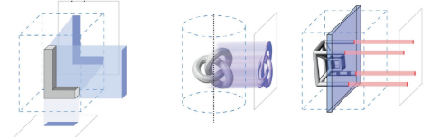
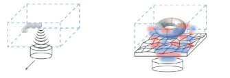
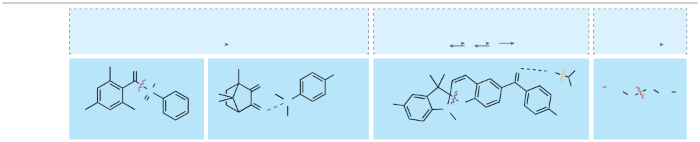
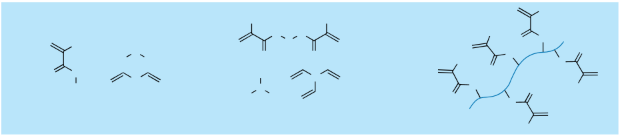
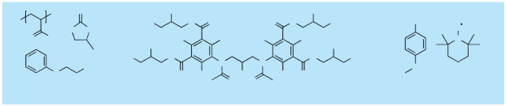
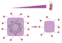
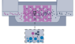

**Review article![ref1]**

**nature reviews** materials <https://doi.org/10.1038/s41578-025-00785-3>

**Review article **Check for updates

The road ahead in materials and technologies for volumetric 3D printing

**Paulina Nunez Bernal  ** [^1]**, Sammy Florczak1,2, Sebastian Inacker  [**3,**](http://orcid.org/0000-0001-6890-7889) Xiao Kuang4,5, Jorge Madrid-Wolff  6[**,** ](http://orcid.org/0000-0003-3945-538X)Martin Regehly7, Stefan Hecht3, Yu Shrike Zhang  4[**,8,9,**](http://orcid.org/0000-0002-0045-0808) Christophe Moser  6 [**&** ](http://orcid.org/0000-0002-2078-0273)Riccardo Levato  1,2**

[Nature Reviews Materials](http://www.nature.com/natrevmats)
**Review article![ref1]**

**Abstract**

Volumetric 3D printing enables the rapid fabrication of centimetre- scale objects, with the fastest techniques requiring only a few seconds. Having emerged during the past 7 years, this new family 

of technologies is posed to revolutionize additive manufacturing, fabricating objects and functional parts in a layerless fashion directly within a vat of material in response to optical and acoustic fields. Modern volumetric 3D printing methods are overcoming many challenges inherent to conventional layer-by-layer approaches, the standard in research and industry for the past 40 years. This Review focuses on identifying upcoming challenges and research directions in materials chemistry and process engineering to move volumetric 3D printing from its infancy to its broader adoption. Recent advances include the development of techniques based on optical tomography, light and acoustic holography, xolography, multiwavelength and upconversion-mediated printing, as well as the introduction of materials with custom-designed properties. Promising applications in the development of optical and photonic components, rapid prototyping, soft robotics and bioprinting of living cells are discussed along with a vision for the evolution of volumetric manufacturing towards a broadly accessible technology platform.

**Sections**

Introduction

Field-based volumetric manufacturing technologies

Materials design for volumetric printing

Emerging applications

Hardware and computational advancements

Future perspectives

[Nature Reviews Materials](http://www.nature.com/natrevmats)
**Review article![ref1]**

**Introduction** we highlight upcoming challenges and discuss new printing modalities **From layerwise to layerless fabrication** to overcome existing limitations and enable the wide adoption of With the ability to build complex, multimaterial architectures start- volumetric printing in both industry and research.

ing from any computer-aided design, 3D printing has opened new 

avenues in multiple industrial and manufacturing processes, includ- **Field-based volumetric manufacturing technologies** ing the production of speciality parts in automotive and aerospace  In the past decade, a growing range of field-based volumetric manu-

industries1, [p](#_page13_x39.00_y630.87)atient-specific prostheses, medical devices, drugs for  facturing technologies have been introduced (Fig. 2[). ](#_page3_x39.00_y635.87)To contextualize 

personalized medicine, advanced drug testing and disease model- their establishment and ongoing developments, Table1 s[ummariz](#_page4_x39.00_y108.87)es ling platforms2. [N](#_page13_x39.00_y646.87)otably, since its inception, the concept of 3D print- studies that demonstrated a key technical or application advancement ing has ushered new research frontiers and a revolution in materials  for each of the techniques discussed in this section.

engineering: the rapid, near-instantaneous bottom-up fabrication of 

virtually any object. **M                                                                                                                                                                                                                                                                                                                                                                                                                                                                                                                                                                                                                                                                                                                                                                                                                                                                                                                                                                                                                                                                                                                                                                                                                                       u                                                          l                     t   i    beam superposition and tomographic volumetric printing**

Yet, since the development of the first additive manufacturing  Among the various approaches to volumetric printing, light-based \
techniques more than 40 years ago, 3D printing has been relying on the  methodologies were the first to emerge owing to the extensive lit -

principle of layer-by-layer fabrication, in which the desired materials  erature on photochemical reactions and to the solid background are deposited as single voxels, lines or planes to form 2D-like patterns  on light-responsive materials accumulated during the four-decade- that are successively built up into a 3D structure. Key examples are  long experience with stereolithographic layer-wise 3D printing. extrusion and other nozzle-based techniques, such as fused deposition  By controlling parameters such as wavelength, intensity and spa -

modelling and drop-on-demand printing3, sele[ct](#_page13_x39.00_y654.87)ive laser sintering  tial distribution of light, it is possible to induce spatiotemporal and melting approaches4 [and](#_page13_x39.00_y670.87) technologies based on spatial-selective  resolved photochemical reactions deep within a volume. Although photopolymerization of reactive materials, such as stereolithographic  all light-based volumetric printing techniques share this common methods5.[ Albeit](#_page13_x39.00_y686.87) versatile, these layer-by-layer processes lead to con- foundational premise, they differ substantially in their approaches to siderably slow production rates (hours for multi-cubic-centimetre  delivering the crucial 3D light dosage. Each technique uses specific parts)6,[7,](#_page13_x39.00_y702.87)limitations on the classes of materials that can be printed  strategies to overcome the inherent challenges of light penetration, and limited capacity to resolve highly convoluted designs without  scattering and precise energy distribution, resulting in a diverse depending on sacrificial support materials8.array of methodologies.

Volumetric printing, also termed volumetric additive manufactur- An early volumetric printing approach was based on multibeam ing (VAM), is a new fabrication paradigm that addresses these limita- superposition12,[13. ](#_page13_x305.00_y181.87)[This](#_page13_x305.00_y189.87) technique relies on the superposition of three tions, allowing for the first time the layerless production of objects with  co-incident, patterned light projections onto a vat containing a photo -

unprecedented speed, with the highest-throughput techniques taking  responsive material. Although all the resin in the path of the beams is less than 10 s to build cubic-centimetre parts, at resolutions of tens of  exposed, the regions where the beams overlap receive a higher light micrometres, and with high design freedom8–10. V[o](#_page13_x305.00_y109.87)[lu](#_page13_x305.00_y141.87)metric printing  dose, above the gelation threshold of the polymer precursor, trigger- encompasses a broad variety of vat polymerization printing technolo- ing rapid volumetric crosslinking, whereas the rest of the vat remains gies, which rapidly produce whole parts at once within a volume of  unreacted (Fig.1a[). ](#_page2_x391.00_y110.87)Despite representing a significant conceptual leap, interest. These technologies enable 3D chemical reactions to occur in  this technique has limited ability to resolve intricate geometries. Nev -

a controlled, contactless manner, even at multi-centimetre distances  ertheless, the principle of taking advantage of the threshold behaviour within the volume of a material. Typically, these reactions include  of certain photochemical reactions became the basis of more advanced polymerization and crosslinking, controlled ablation or spatial pattern- light-based volumetric printing methods.

ing of material properties11. [A ](#_page13_x305.00_y157.87)distinguishing trait of all technologies  Volumetric printing broke new ground with the introduction within the family of volumetric printing is that the working principles  of tomographic-based technologies, which drew inspiration from are based on what can be defined as field-based manufacturing, with the  computed tomography in 3D medical imaging. Unlike beam superposi -

capacity to operate at long (centimetre-scale) distances within a resin  tion, tomographic volumetric printing reconstructs a target 3D light vat. Volumetric printing relies on radiating complex and inhomogene- dosage by projecting a series of pre-calculated 2D light patterns from ous physical fields, typically optical and acoustic fields, into the vat to  multiple angles into a rotating cylindrical volume of photosensitive generate a spatially resolved energy dose distribution12. This [trigg](#_page13_x305.00_y181.87)ers  resin8–10 (Fig[. ](#_page13_x305.00_y109.87)[1b](#_page13_x305.00_y141.87)). Pro[jec](#_page2_x391.00_y110.87)tions are calculated following tomographic controlled chemical reactions that lead to the formation of the desired  algorithms (Radon transform and filtered back projection) and are object (Fig. [1](#_page2_x391.00_y110.87)). These physical fields can also be used to manipulate the  delivered by means of an amplitude-type spatial light modulator (such arrangement of elements, such as particles and cells, within the vat to  as a digital micromirror device) illuminated by a light-emitting diode create hierarchically organized, hybrid structures. or laser source, then imaged to the centre of the print volume. The 

This Review discusses the integration of physical approaches,  cumulative sum of these projections over all angles results in the for- process engineering and materials chemistry for the development and  mation of a complex light dose that is maximized within the bounds advancement of volumetric printing. First, key volumetric printing  of the target geometry, thus inducing photopolymerization within the technologies are contextualized, together with their specific advan- desired region, whereas the unreacted material is washed away at the tages and challenges. Design criteria for developing new printable  end of the process. This approach enables the fabrication of almost resins and materials compatible with these techniques are detailed,  unconstrained, centimetre-scale geometries within tens of seconds, with a particular focus on printing mediated by light and sound stimuli.  much faster than traditional layerwise 3D printing techniques. Tomo -

We discuss salient applications of layerless manufacturing in opti- graphic printing was first demonstrated with acrylate resins8,9 and cal systems, photonic and acoustic devices, robotic elements, engi- with hydrogels laden with living cells for bioprinting applications10. neered biological tissues and regenerative medicine therapies. Finally,  To date, it has become the most widely used volumetric printing ![ref2]

**Light-based VAM Fig. 1 | Overview of different families of volumetric printing technologies.** There are two broad categories of volumetric additive manufacturing 

a b c

(VAM) techniques, utilizing either light or sound as Multibeam superposition printing Tomographic printing Light sheet printing the primary energy source. **a**, The beam superposition 

method utilizes the intersection of three projection 

beams to fabricate a 3D structure. **b**, The tomographic- based approach uses tomographic projections to deliver complex 3D light dosages. **c**, Light sheet printing combines a light sheet that moves linearly across the vat with orthogonal projections that crosslink the material at the intersection between 

the two optical paths. **d**, Two types of focused 

ultrasound crosslinking, direct sound printing and 

deep-penetrating acoustic volumetric printing use 

focused acoustic energy to crosslink material at specific 

voxel locations. **e**, Holographic direct sound printing d e incorporates a holographic phase plate to shape the 

Single-voxel direct sound printing  Holographic direct sound printing ultrasound wavefront, allowing for arbitrary intensity and deep-penetrating acoustic  distributions.

volumetric printing

**Acoustic-based VAM**

[Nature Reviews Materials](http://www.nature.com/natrevmats)
**Review article![ref1]**

approach14,[15](#_page13_x305.00_y205.87)[ w](#_page13_x305.00_y221.87)ith multiple materials already optimized for this technology16. Although tomographic printing is currently the fastest additive manu - facturing technology available, its broader application and industrial adoption are strongly dependent on further developments in recon-

struction algorithms to enhance contrast between the intended print and off-target regions of the resin, on the mitigation of light scattering in composite resins and on overcoming light attenuation challenges to fabricate large parts.

**Lightsheet-based printing**

Although tomographic printing operates in a radial geometry, other approaches use light sheets to print thin layers within the resin volume in planar-faced vessels. Dual-colour photopolymerization printing, such as xolography, utilizes two optical paths: an ultraviolet (UV) light sheet sweeps across the volume to temporarily activate a photoswitch - able photoinitiator, and, concurrently, an orthogonal patterned vis - ible light projection locally induces polymerization and crosslinking at the overlap of the two beams17–19 [(F](#_page13_x305.00_y253.87)[ig](#_page13_x305.00_y277.87). 1c). [As](#_page2_x391.00_y110.87) the light sheet scans across the volume, the projection is continuously updated to the cor- responding cross-section of the target geometry. A major advantage of this approach is the use of fast thermal reversible photoswitchable initiators, which prevents out-of-plane crosslinking after the initiator undergoes thermal relaxation into its unreactive state. This confine - ment of the polymerization reaction allows for a higher dosage contrast compared with tomographic approaches. Xolography thus enables the production of centimetre-scale objects in minutes, with feature sizes down to a few micrometres.![ref2]

An approach similar to xolography, lightsheet 3D microprinting20, works on the microscale and utilizes two-step photoinitiators. The use of microscope objectives for both the lightsheet generation and the perpendicular projection paths yields higher resolution features (~1 µm) at the expense of printable volume, making this method par- ticularly suited for applications requiring intricate fidelity. Efforts to use more general photoinitiators have also led to other techniques that rely on the precise spatial control of light rather than on special- ized photochemistry. High-resolution volumetric printing has been achieved by leveraging the intersection of two orthogonal light sources of the same wavelength to confine the photo-crosslinking reaction21. Here, a 2D galvanometer scans a beam orthogonally along the plane of a lightsheet, with exposure conditions set to ensure dosages remain below the crosslinking threshold in all but in-plane regions. Although this approach attempts to minimize out-of-plane exposure, it does not eliminate it; thus, high-contrast dosage targets become proportionally more difficult with increasing feature height, making this method better suited for thinner planar constructs.Overall, key challenges in printing approaches based on light sheets are improving the printing speed by introducing faster-relaxing initiators and using more common initiators to broaden the user base.

**Acoustic field-based volumetric printing**

Although light-based volumetric approaches are prevalent, deliver - ing precise light patterns across large volumes is challenging when printing materials that are not transparent at the wavelength used for polymerization, or when printing composite materials with opaque 

[Nature Reviews Materials](http://www.nature.com/natrevmats)
**Review article![ref1]**

**2017**

Multibeam superposition

Multibeam superposition Tomographic printing Light sheet printing Acoustic printing Ultrasound holography

**2019**

Tomographic printing

Volumetric bioprinting

Tomographic printing with o line feedback loops

Thiol-ene resins for VAM

Xolography

**2022**

Glass and ceramics Multimaterial for tomographic VAM prints

Light scattering mitigation (index matching and computational methods)

Direct sound printing

Tomographic printing +

two-photon ablation Xolography with  lowing vat Tomographic printing +

melt electrowriting Sono-ink

Embedded extrusion Extracellular matrix resins

volumetric printing

VAM in microgravity Roll-to-roll VAM

Metamaterials via VAM **2025**

Holographic direct sound printing Sonoprint

`  `VAM with magnetic  ields, microwaves, X-rays   Continuous production

`  `Materials chemistry-aware printing

`  `Holographic VAM

`  `Novel photo-orthogonal chemistries

`  `AI and imaging-driven metrology and printing   Industrial adoption

`  `Clinical translation of volumetric bioprinting

**Fig. 2 | Timeline of major milestones and future developments of volumetric printing approaches.** Timeline of major breakthroughs and envisioned advancements in the field in the coming years. The colours indicate with which volumetric additive manufacturing (VAM) technology the approach was first demonstrated. AI, artificial intelligence.

inclusions as scattering elements. Although strategies to overcome these issues are discussed later in this Review, researchers have also explored alternative physical fields to achieve rapid volumetric ![ref2]

fabrication. Acoustic field-based printing techniques have emerged as a promising avenue. Sound waves have previously been harnessed for the manipulation and spatial patterning of particles, including liv - ing cells. These sound-based assembly approaches leverage acoustic forces to create complex distributions without the need for support materials or direct contact. Acoustic cell patterning typically uti - lizes standing wave fields to generate pressure nodes and antinodes, in which cells or microparticles are trapped and organized into pre - defined arrangements22–25[. ](#_page13_x305.00_y325.87)[Ta](#_page13_x305.00_y381.87)king this concept further, precisely controlled acoustic waves have been harnessed to selectively solidify materials within a volume26,2[7 o](#_page13_x305.00_y405.87)[ff](#_page13_x305.00_y421.87)ering unique advantages in terms of material compatibility and penetration depth.Direct sound printing (DSP) and deep-penetrating acoustic volumetric printing (DAVP) are additive manufacturing processes that utilize focused ultrasound to print within a volume of resin26,27[. ](#_page13_x305.00_y405.87)[Fo](#_page13_x305.00_y421.87)cused ultrasound can generate localized cavitation or high-temperature regions within sound-active inks containing a sonoresponsive initiator, initiating a sonochemical or sonothermal polymerization reaction. By translating the focal point, a 3D structure is volumetrically printed with sub-millimetre resolu - tion (Fig.[1d).](#_page2_x391.00_y110.87) An evolution of this approach is holographic DSP. Here, a 3D-printed acoustic holographic phase plate is positioned above the ultrasonic transducer. Its purpose is to encode the phase information needed to shape the ultrasound wavefront into an arbitrary focus — in this case, the cross-section of the target geometry28. This[ a](#_page13_x305.00_y437.87)pproach has the advantage of rapidly polymerizing multiple regions simultaneously, thus forming the desired object in a single shot (Fig. [1e](#_page2_x391.00_y110.87)). However, because the 3D-printed phase plate cannot be modulated, the inten - sity pattern at the focal plane remains fixed, and thus more complex 3D structures can only be fabricated through translations of this plane.

**Materials design for volumetric printing**

The growth and impact of volumetric printing are intimately linked to the development of new material formulations and a deeper under - standing of the material properties required for high-resolution, high-efficiency printing. The starting materials for volumetric printing, 

known as resins or bioresins, contain different categories of compo - nents (Fig.3[).](#_page7_x39.00_y414.87) VAM requires different resin compositions from layerwise techniques and opens promising possibilities for integrating innovative materials and new functions. The individual components of the resins 

can be divided into two major categories. The first are the initiators, molecules that convert different stimuli (optical and acoustic) into reac - tive species that induce a spatiotemporally controlled polymerization 

reaction. The second are the various classes of reactive materials that lead to the formation of crosslinked polymer networks in response to 

the printing stimuli through various chemical reactions. Beside these two main classes, other compounds can be used to improve shape 

fidelity and resolution: the additives. They are not directly involved in the material crosslinking process, but fulfil other important func - tions, such as rheological modulation, refractive index matching and 

contrast enhancement27,29–[32](#_page13_x305.00_y421.87)[.](#_page13_x305.00_y453.87)

**Initiators and reactive species**

The pivotal element for all volumetric printing resins is the initiator, which translates the spatiotemporal information of the stimulus into chemical reactivity. Although tomographic printing and dual-colour photopolymerization printing use UV and visible light as stimulus for photochemical triggered polymerization, DAVP uses focused ultra - sound in combination with thermal initiators. Tomographic print - ing uses mostly type I photoinitiators based on phosphine oxide16, 

[Nature Reviews Materials](http://www.nature.com/natrevmats)
**Review article![ref1]**

**Table 1 | Advancements in field-based volumetric manufacturing technologies![ref2]**

<table><tr><th colspan="1" valign="top"><b>Technique</b></th><th colspan="1" valign="top"><b>Resin composition</b></th><th colspan="1" valign="top">
<b>Reported max resolution (μm)</b>

<b>a</b>
</th><th colspan="1" valign="top"><b>Reported max print volume</b></th><th colspan="1"><b>Estimated print speed (mm3 s−1)b,c,d,e</b></th><th colspan="1" valign="top"><b>Main advancement</b></th></tr>
<tr><td colspan="1" valign="top">Multibeam superposition</td><td colspan="1" valign="top">Resin: PEGDA PI: Irgacure 784</td><td colspan="1" valign="top">300–400</td><td colspan="1" valign="top">0\.1 cm3</td><td colspan="1" valign="top">517\.8–35.6</td><td colspan="1">
Introduced the concept of beam superposition to fabricate complex 

3D structures through the simultaneous projection of patterned optical fields from multiple laser beams13
</td></tr>
<tr><td colspan="1" rowspan="8" valign="top">Tomographic volumetric printing</td><td colspan="1" valign="bottom">
Resins: BPAGDA/PEGDA GelMA

PIs:

CQ + EDAB Ru/SPS
</td><td colspan="1" valign="top">200</td><td colspan="1" valign="top">21\.5 cm3</td><td colspan="1" valign="top">20</td><td colspan="1" valign="top">Introduced the concept of tomographic volumetric printing using acrylate polymers, achieving the ultrafast fabrication of centimetre-scale objects and demonstrating overprinting over opaque elements8</td></tr>
<tr><td colspan="1" valign="top">Resin: GelMA PI: LAP</td><td colspan="1" valign="top">145</td><td colspan="1" valign="top">0\.5 cm3</td><td colspan="1" valign="top">42</td><td colspan="1">Introduced volumetric bioprinting, achieving a maximum single-cell density of 10 × 106 cells ml−1 within a biocompatible gelatin methacryloyl bioresin. Patient-derived stem cells showed high viability (>85%) and tissue-specific maturation10</td></tr>
<tr><td colspan="1" valign="bottom">
Resins:

TAE-ICN

TEGDA: TAE-ICN (1:1) TA-ICN: TME-ICN (1:1) TEGDAE: TME-ICN (1:1) PI: I907

Additive: TEMPO
</td><td colspan="1" valign="top">850</td><td colspan="1" valign="top">3\.0 cm3</td><td colspan="1" valign="top">
Not reported — thiol-ene resins require 2.8–3.4× lower dose 

than acrylate resins
</td><td colspan="1" valign="top">
Introduced volumetric prints using thiol-ene materials, achieving higher printing speeds than with acrylate 

resins. Introduced TEMPO as an additive radical scavenger that creates a nonlinear polymerization behaviour

[43](#_page13_x305.00_y693.87)
</td></tr>
<tr><td colspan="1" valign="top">
Resin: GelMA

PI: LAP

Additive: Iodixanol
</td><td colspan="1" valign="top">
41\.5 (cell-free)

50\.5 (organoid-laden)
</td><td colspan="1" valign="top">0\.5 cm3</td><td colspan="1" valign="top">38</td><td colspan="1" valign="bottom">
Introduced volumetric bioprinting 

of functional 3D organoid structures that maintain their viability and organization, and the refractive index matching approach using iodixanol to increase cell densities (max. 15 × 10 cells ml−1) while maintaining printing resolution29

6
</td></tr>
<tr><td colspan="1" valign="top">
Resin: Glassomer µSLf + TMPTA/HEMA (binders)

PI: CQ + EDAB Additive: TEMPO
</td><td colspan="1" valign="top">20 (resin precursor) 50 (fused silica)</td><td colspan="1" valign="top">0\.8 cm3</td><td colspan="1" valign="top">0\.3–0.1</td><td colspan="1">Reported the highest resolution printing via microscale tomographic volumetric printing, and the first instance of silica glass printing, enabling the fabrication of microfluidic components and micro-optical elements57</td></tr>
<tr><td colspan="1" valign="bottom">
Resins: DPHA PRO21905g GelMA PIs:

BAPO LAP
</td><td colspan="1" valign="top">585</td><td colspan="1" valign="top">0\.5 cm3</td><td colspan="1" valign="top">12\.8</td><td colspan="1" valign="top">
Introduced an algorithm-based approach to mitigate light scattering-induced printing artefacts in the presence of homogeneous 

TiO2 nanoparticles and living cells 

(up to 4 × 106 cells ml−1) based on spatial frequency analysis and correction 

of images of the printing vial101
</td></tr>
<tr><td colspan="1" valign="top">Resin: PRO21905g PI: BAPO</td><td colspan="1" valign="top">250</td><td colspan="1" valign="top">12 cm3</td><td colspan="1" valign="top">40</td><td colspan="1">Establishment of volumetric helical additive manufacturing approach to increase the maximum printable volume using tomographic projections149</td></tr>
<tr><td colspan="1" valign="top">
Resins:

DUDMA DUDMA/PEGDA (80/20%) PI: TPO-L
</td><td colspan="1" valign="top">127</td><td colspan="1" valign="top">1\.2 cm 3</td><td colspan="1" valign="top">12\.5</td><td colspan="1">Introduced a deconvolution method for VAM to address size-dependent polymerization errors caused by light dose diffusion and optical blurring. By incorporating experimentally measured diffusion coefficients and optical point spread functions, the deconvolution technique optimizes light dose patterns44</td></tr>
</table>

**Table 1 (continued) | Advancements in field-based volumetric manufacturing technologies![ref2]**

<table><tr><th colspan="1" valign="top"><b>Technique</b></th><th colspan="1" valign="top"><b>Resin composition</b></th><th colspan="1" valign="top">
<b>Reported max resolution (μm)</b>

<b>a</b>
</th><th colspan="1" valign="top"><b>Reported max print volume</b></th><th colspan="1"><b>Estimated print speed (mm3 s−1)b,c,d,e</b></th><th colspan="1" valign="top"><b>Main advancement</b></th></tr>
<tr><td colspan="1" rowspan="7" valign="top">Lightsheet printing</td><td colspan="1">Resins: PETA, DUDMA PI: DCPI + CoIn</td><td colspan="1">25 (<i>x</i>, <i>y</i>) 50 (<i>z</i>)</td><td colspan="1" valign="top">3\.0 × 3.0 × 3.0 cm</td><td colspan="1" valign="top">55</td><td colspan="1" valign="top">Introduced dual-colour photo initiators and the xolography principle17</td></tr>
<tr><td colspan="1" valign="top">Resin: DUDMA PI: DCPI + CoIn</td><td colspan="1" valign="top">10 (<i>x</i>, <i>y</i>) 25 (<i>z</i>)</td><td colspan="1" valign="top">1\.7 × 1.0 × 1.0 cm</td><td colspan="1" valign="top">1\.75</td><td colspan="1">Introduced xolography-based continuous flow volumetric 3D printing1[8](#_page13_x305.00_y261.87)</td></tr>
<tr><td colspan="1">
Resins:

PETA, DUDMA, BDDA, DMAm in different combinations

PI: DCPI + CoIn

Additives: RAFT agents, dyes
</td><td colspan="1" valign="top">20</td><td colspan="1" valign="top">0\.9 × 1.6 × 1.0 cm</td><td colspan="1" valign="top">4\.8</td><td colspan="1" valign="top">Enabled multimaterial printing and post-modification of prints using RAFT mechanism19</td></tr>
<tr><td colspan="1" valign="bottom">
Resin: mixture of H44, PEGDA, DUDMA, SiO2

PI: DCPI + CoIn Additive: SiO2, camphor
</td><td colspan="1" valign="top">100</td><td colspan="1" valign="top">0\.9 × 1.6 × 1.0 cm</td><td colspan="1" valign="top">2\.4</td><td colspan="1" valign="top">
Enabled printing of complex SiOC ceramics from hybrid polymer precursor and subsequent pyrolysis

[59](#_page14_x39.00_y341.87)
</td></tr>
<tr><td colspan="1" valign="top">
Resin: DUDMA, ACMO PI: DCPI + CoIn

Additive: zirconia NP, camphor, MEHQ
</td><td colspan="1" valign="top">Not reported</td><td colspan="1" valign="top">0\.9 × 1.6 × 1.0 cm</td><td colspan="1" valign="top">2\.4</td><td colspan="1">Showed the possibility to apply volumetric printing for ceramics following the classical powder-based route by choosing a substrate with the appropriate optical properties (absorption, scattering)30</td></tr>
<tr><td colspan="1" valign="top">
Resins: DUDMA, TMPTA, Genomer 4622, ACMO, PEGDA

PI: DCPI + CoIn Additive: PAA, SiO2 NP
</td><td colspan="1" valign="top">
20–30 (<i>x</i>, <i>y</i>)

300–500 (<i>z</i>) (material-dependent)
</td><td colspan="1" valign="top">0\.9 × 1.6 × 1.0 cm</td><td colspan="1" valign="top">57\.6</td><td colspan="1">Applied xolography in microgravity during ZeroG flights and described in-depth the material platforms and requirements in terms of viscosity. Printing speed was increased to perform experiments within the 20  s time windows of microgravity allowed on parabolic flights31</td></tr>
<tr><td colspan="1">Resin: DHEPA PI: diacetyl Additive: TEMPO</td><td colspan="1" valign="top">0\.5</td><td colspan="1" valign="top">Not reported</td><td colspan="1" valign="top">0\.231</td><td colspan="1" valign="top">Introduced microscale lightsheet 3D printing20</td></tr>
<tr><td colspan="1" valign="top">Direct sound printing</td><td colspan="1">
Resin: PDMS Initiator-free

Additive: silica/Al2O3  microparticles, Fe and Al nanoparticles, oil dyes (optional)
</td><td colspan="1" valign="top">280 (lateral)</td><td colspan="1" valign="top">50 × 50 × 4 mm</td><td colspan="1" valign="top">0\.5</td><td colspan="1" valign="top">
Introduced direct sound printing of PDMS and their composites

[26](#_page13_x305.00_y405.87)
</td></tr>
<tr><td colspan="1" valign="top">Deep penetration acoustic volumetric printing</td><td colspan="1">
Resin: Sono-ink (PEGDA or GelMA)/LCST polymer slurry

Initiator: APS

Additive: agar microparticles, hydroxyapatite (optional), drug (optional), optical/fluorescent dyes (optional)
</td><td colspan="1" valign="top">700–5,000 (axial) 1,500 (lateral)</td><td colspan="1" valign="top">90 × 90 × 24 mm</td><td colspan="1" valign="top">0\.8–5.5</td><td colspan="1" valign="top">Introduced acoustic volumetric printing without a build platform and described their general sono-ink design for proof-of-concept minimally invasive medicine, including lesion occlusion, tissue reconstruction and drug delivery2[7](#_page13_x305.00_y421.87)</td></tr>
<tr><td colspan="1" valign="top">Holographic direct sound printing</td><td colspan="1" valign="top">
Resin: PDMS Initiator-free

Additive: oil dye (optional)
</td><td colspan="1" valign="top">1,000 (lateral)</td><td colspan="1" valign="top">15 × 20 mm (1-mm thin wall)</td><td colspan="1" valign="top">7\.0–14.0</td><td colspan="1">Enabled faster direct sound printing using 2D acoustic holographs and complex robot trajectory planning for multiobject and multimaterial printing2[8](#_page13_x305.00_y437.87)</td></tr>
<tr><td colspan="1" valign="top">Ultrasound-mediated polymerization</td><td colspan="1">
Resin: PEGDA (or PVA-MA) Initiator-free

Additive: GelMA, hydroxyapatite, alginate or glycerol, drug (optional)
</td><td colspan="1" valign="top">4,000 (axial) 5,000 (lateral)</td><td colspan="1" valign="top">Not reported</td><td colspan="1" valign="top">Not reported</td><td colspan="1" valign="top">
Introduced cavitation-based sound-triggered gelation for application in cell and drug delivery

[40](#_page13_x305.00_y637.87)
</td></tr>
</table>

**Table 1 (continued) | Advancements in field-based volumetric manufacturing technologies**

|**Technique**|**Resin composition**|
**Reported max resolution (μm)**

**a**
|**Reported max print volume**|**Estimated print speed (mm3 s−1)b,c,d,e**|**Main advancement**|
| - | - | - | :- | :- | - |
|Sound continuous production|
Resin: epoxy-2-ethyl-4- methylimidazole (curing agent) or aliphatic urethane diacrylate + AIBN (initiator)

Additive: Fe nanoparticles, Al2O3 microparticles (optional)
|150 (lateral)|55 × 55 × 40 mm|0\.06–0.70|Introduced sound-based printing of thermosets, composites and multimaterials41|
|Hybrid (tomographic + 2PA)|
Resin: GelNOR/GelSH (1:1) PI: LAP

Additive: Iodixanol
|
240 (VP)

1\.8 (2PA)
|Converged printing max. 500 μm depth (*z*-axis)|Not reported|Combined tomographic volumetric printing with 2PA, enabling the fabrication of multiscale, volumetric structures90|
|Hybrid (tomographic + embedded extrusion)|
Resin: GelMA microbead slurry

PI: LAP
|244|0\. cm3|21|Combined tomographic volumetric bioprinting with embedded extrusion printing, enabling multimaterial and multicellular printing with high cell density regions (50 × 106 cells ml−1)91|
|Hybrid (tomographic + melt electrowritten)|
Resin: GelMA PI: LAP

Additive: PCL melt electrowritten mesh
|145|0\.8 cm3|45|
Combined tomographic volumetric printing with melt electrowritten tubular structures, resulting in mechanical reinforcement of volumetrically printed hydrogels

[83](#_page14_x305.00_y109.87)
|
|Hybrid (tomographic + acoustic patterning)|
Resin: di-pentaerythritol pentaacrylate

PI: BAPO
|2,100|7\.2 cm3|Not reported|Combined tomographic volumetric printing with acoustic wave patterning, enabling the prepatterning of the bioresin components within the vat before printing22|

2PA, two-photon ablation; ACMO, 4-acrylmorpholine; BAPO, phenylbis (2,4,6-trimethylbenzoyl) phosphine oxide; BDDA, bisphenol A digylcid diacrylate; BPAGDA, bisphenol A glycerolate 

(1 glycerol/phenol) diacrylate; CoIn, co-initiator; CQ, camphorquinone; DCPI, dual-colour photoinitiator; DMAm, *N*,*N*-dimethyl acrylamide; DPHA, dipentaerythritol hexaacrylate; DUDMA, diurethane dimethacrylate; EDAB, ethyl 4-dimethylaminobenzoate; GelMA, gelatin methacryloyl; GelNOR, gelatin norbornene; GelSH, gelatin thiol; HEMA, hydroxyethylmethacrylate; 

I907, Irgacure 907; LAP, lithium phenyl(2,4,6-trimethylbenzoyl)phosphinate; LCST polymer, lower critical solution temperature polymer; MEHQ, 4-methoxyphenol; NP, nanoparticle; PAA, polyacrylic acid; PCL, polycaprolactone; PDMS, polydimethylsiloxane; PEGDA, poly(ethylene glycol) diacrylate; PETA, pentaerythritol tetraacrylate; PI, photoinitiator; PVA-MA, poly(vinyl alcohol) methacrylate glycol diallyl ether; RAFT, reversible addition fragmentation chain transfer; Ru, tris(2,2-bipyridyl)dichlororuthenium(II) hexahydrate; SPS, sodium persulfate; TAE-ICN, tris[2-(acryloyloxy)ethyl] isocyanurate; TA-ICN, tri-allyl isocyanurate; TEGDA, triethylene glycol diacrylate; TEGDAE, triethylene glycol diallyl ether;TEMPO, 2,2,6,6-tetramethylpiperidine-1-oxyl; TME-ICN, tris[2-(3-mercaptopropionyloxy)ethyl] isocyanurate; TMPTA, trimethylolpropane triacrylate; TPO-L, ethyl (2,4,6-trimethylbenzoyl) phenylphosphinate; VP, volumetric printing. aFor studies that do not report the maximum resolution, this property is measured from article images. bIt should be noted that printing time does not necessarily scale with volume for multibeam superposition, tomographic printing and holographic direct sound printing, and therefore the fabrication speed would be higher for prints having a larger volume. Although for these techniques reporting the printing time may be more accurate, printing speed values facilitate a direct comparison with other techniques, including conventional layerwise printing. cThe printing speed for multibeam superposition, tomographic volumetric printing and holographic direct sound printing was calculated dividing the volume of the printed objects by the production time. dThe speed of the lightsheet printing techniques was calculated by multiplying the translational shift speed in millimetre per second with the lateral area of the build volume in square millimetre, therefore constituting an estimation of the maximum printable section. eThe print speed for deep penetration acoustic volumetric printing is estimated from the voxel generation rate per second, multiplied with the voxel volume in cubic millimetre. fGlassomer GmbH. gSartomer.

[Nature Reviews Materials](http://www.nature.com/natrevmats)
**Review article![ref1]**

although carbonyl centred type II photoinitiation systems have also been described33–[35.](#_page13_x305.00_y525.87)[ D](#_page13_x305.00_y557.87)ual-colour photopolymerization printing relies on a dual-colour photoinitiator, typically featuring a carbonyl-substituted spiropyran photoswitch in combination with a tertiary amine co-initiator17,[ a](#_page13_x305.00_y253.87)lthough bicarbonyl structures have also been used For all photoinitiators, it is desirable to have molecular systems with distinct absorption bands that allow for selective excitation.

Independent of the type of radiation source, the absorption by the initiator leads to an exponential attenuation of excitation irradiance across the resin vat that limits polymer conversion as light penetrates deeper into the vial, as described by the Lambert–Beer law. To limit the resulting inhomogeneous crosslinking, the initiator concentration is kept low in contrast to the typical design requirements for resins opti mized for layer-wise printing (stereolithography). In volumetric print ing, attenuation from high concentrations of photoinitiators would result in low light doses delivered into the middle of the vat, effectively reducing the maximum productive penetration depth and therefore ![ref2]

the maximum size of the printed object. As a consequence, initiators with high efficiency (the ratio between the absorbed input energy and the number of reactive species generated) are required. Although the radical formation efficiency of typical tomographic printing and 

[20](#_page13_x305.00_y293.87).  DAVP initiators is intrinsically high owing to established structural 

motifs, current dual-colour photoinitiators are not optimized in this regard and often require high concentrations of co-initiating species, somewhat limiting the variety of printable materials to more reactive resins[31. ](#_page13_x305.00_y485.87)Thus, alternative initiation mechanisms need to be explored, for example, based on photoredox reactions or nonlinear excitation36. These mechanisms also allow for further red-shifting of the wavelength, beneficial in the context of printing living matter37.

- Attenuation of the printing stimulus throughout the vat volume 
- is less problematic in sound-based approaches. Initiators triggered by acoustic waves (ultrasound waves, 1–10 MHz) are compatible with pene - tration through large resin vats up to tens of centimetres across and even across opaque matter, such as living tissues, thus potentially allowing to 

[Nature Reviews Materials](http://www.nature.com/natrevmats)
**Review article![ref1]**

**Multibeam tomographic printing Light sheet printing Sono printing PI**   1     **I• A** 1 **B** 2 **C I• SI** Soundwaves **I•**

O CO2Et O H R

X

O

P R2N 3S O O SO3

O

**Initiators** O N NC O

O N

F

**Uni-colour type I Uni-colour type II Dual-colour type II Sono type I**

R’

R’ R’

R’

R’ X R X O X

R O O X O HS SH R’ X

**Building blocks** O

O X R’ SH R’

R R X O R’

HS SH O

X

**Monomers Crosslinkers (Bio)polymers**

R’

O OH OH

H H

*n* HO N O O N OH OH

O O O

O OH I I I I N

OH OH

H H

**Additives** HO N N OH

N N

OH O

O O I OH I O

O O

**Rheology modi iers Refractive index matchers Contrast enhancers**

[Nature Reviews Materials](http://www.nature.com/natrevmats)
**Review article![ref1]**

**Fig. 3 | Key components of the resins for volumetric printing.** Resin components for volumetric 3D printing methods showing exemplary structures for the different material classes and printing techniques. The major components outlined here are initiators, building blocks for the polymerization and crosslinking reactions and additives. Initiators translate stimuli to reactivity taking advantages of different cleavage reactions (shown schematically in the top row), enabling the polymerization of the resin building blocks. Commonly used motifs are unimolecular single-colour phosphine-oxide initiators (type I photoinitiators, which undergo a unimolecular bond cleavage upon exposure to ultraviolet (UV) light, generating free radicals) or bimolecular dicarbonyl-based initiators (type II photoinitiators, which require a co-initiator to generate free radicals) for multibeam and tomographic methods; spiropyran–merocyanine 

print even in vivo, in a surgical theatre38. V[ar](#_page13_x305.00_y605.87)ious sonochemistries involv - ing different reactive species have been used to trigger polymerization39 and explored for sound-based printing26,27,40–[42](#_page13_x305.00_y405.87)[. ](#_page13_x305.00_y421.87)[Fo](#_page13_x305.00_y637.87)r[ e](#_page13_x305.00_y669.87)xample, through water cavitation, reactive oxygen species such as hydroxyl radicals trigger slow initiator-free polymerization of vinyl species40. In ad[di](#_page13_x305.00_y637.87) - tion, sono-induced heating of a thermal initiator has been exploited for DAVP[27](#_page13_x305.00_y421.87). The local heat at the focus point of the ultrasound enables polymer crosslinking in seconds. To assist the focusing process, the addition of rheological modifiers and of a phase-transition acoustic absorber is essential to compromise between acoustic streaming — the fluid flow driven by the high-amplitude pressure of focused acoustic waves — and penetration depth27. I[n ](#_page13_x305.00_y421.87)ultrasound-based techniques, acoustic absorption has a critical role in converting mechanical energy into chemical reactivity, which is influenced by the ultrasound profile, including frequency, pulse duration and duty cycle27.

A further challenge in tomographic printing is achieving sufficient printing contrast, that is, translating intensity ratios into feature ![ref2]

couple combined with tertiary amine type II dual-colour initiators for light sheet printing (which undergoes a structural change when exposed to a first, UV excitation wavelength and, in this excited state, reacts in the presence of a secondary, red excitation wavelength, producing free radicals); and thermal initiators for sono printing (which undergo cleavage and generation of radicals in response to redox reactions triggered by thermal stimuli). The main building blocks for the polymer network can be monomers, crosslinkers and (bio) polymers carrying reactive groups, such as unsaturated bonds. Additives include a diverse array of compounds that enhance printing resolution and shape fidelity via, for example, rheology modification, refractive index matching or contrast enhancement.

sharpness. Besides the choice of printing hardware, the reactivity of the initiator and monomer/crosslinker also has a pivotal role. For example, improved contrast in tomographic printing has been achieved by slowing down the crosslinking kinetics through the addi - tion of radical scavengers such as 2,2,6,6-tetramethylpiperidine-1-oxyl (TEMPO)[43](#_page13_x305.00_y693.87). Conversely, in dual-colour photopolymerization printing, the merocyanine form also absorbs the incident UV light, opening up a competing single-wavelength channel that leads to undesired UV-mediated crosslinking. By separating the absorption of the dor - mant and active forms, the spectral and thus spatial addressability of the initiator molecules inside the volume and therefore the reach- able contrast increase. Although light as stimulus provides exquisite spatial resolution, local heat generation is hard to control owing to dissipation; therefore, a lower contrast and resolution is associated with DAVP. For all techniques, the diffusion of reactive species lowers the achievable printing contrast and can reduce printing resolution, even after the stimulus is removed, for example, during dark curing. 

[Nature Reviews Materials](http://www.nature.com/natrevmats)
**Review article![ref1]**

By adding radical inhibitors, this diffusion is limited and contrast can be significantly enhanced43–4[5.](#_page13_x305.00_y693.87)

**Precursors for light-based and acoustic printing**

Various material systems including vinyl and epoxide monomers have been used for VAM16[,41](#_page13_x305.00_y237.87)[,46](#_page13_x305.00_y653.87)[,47](#_page14_x39.00_y109.87)[. ](#_page14_x39.00_y125.87)An extensive list of materials is beyond the scope of this Review; hence, we refer the readers to a recently published 

work on resins for tomographic volumetric printing16. Poly[m](#_page13_x305.00_y237.87)erization mechanisms are divided into step-growth and chain-growth polymeri - zation. Acrylates and acrylamides, which can be easily grafted onto 

most synthetic and biobased polymers, are the most commonly used reactive components for free-radical chain-growth polymerization. Although acrylates offer rapid reaction rates and low costs, they exhibit considerable oxygen sensitivity, non-uniform crosslinking and large 

volume shrinkage. The latter may lead to material sedimentation at low resin viscosity, impacting printing quality, whereas oxygen sensitivity 

has been advantageous to set a curing threshold, improving resolution in multibeam and tomographic printing48. By[ co](#_page14_x39.00_y141.87)ntrast, step-growth reactions, such as thiol-ene click chemistry, which uses norbornene and allyl-glycidyl ether-modified polymers32,49, [sh](#_page13_x305.00_y501.87)[o](#_page14_x39.00_y165.87)w high oxygen tolerance 

and faster reaction rates, but benefit from the addition of inhibitors of the reaction to improve contrast during printing43,49. [Mor](#_page13_x305.00_y693.87)[eo](#_page14_x39.00_y165.87)ver, they 

form more homogeneous polymer networks with reduced shrinkage, good optical transparency, high refractive index50,51, en[ha](#_page14_x39.00_y181.87)[n](#_page14_x39.00_y205.87)ced tough -

ness and tunable stiffness43. [Among](#_page13_x305.00_y693.87) other relevant chemistries, epox - ide oligomers for catalytic ring-opening polymerization initiated by photoacid generators have been used for ultrasound-based printing41. 

By blending multiple types of hybrid monomers/oligomers with differ - ent reaction mechanisms and reaction rates, such as acrylate-epoxy, 

their advantages can be combined52. In[ th](#_page14_x39.00_y221.87)ese dual-cure systems, photo - curing of the acrylate component defines the shape of the printed parts, 

whereas a subsequent post-thermal curing step induces the crosslink - ing of thermoset components, such as epoxy resin, to form an inter - penetrating polymer network with enhanced mechanical properties53. Unmodified protein materials relevant for biomedical applications and bio-inspired materials also permit light-based tomographic printing 

via di-tyrosine-mediated crosslinking, as shown with silk fibroin and sericin, and decellularized extracellular matrix34,35. T[a](#_page13_x305.00_y541.87)[kin](#_page13_x305.00_y557.87)g inspiration from these studies, more photo(redox)-driven reactions should be explored to expand the library of materials for volumetric printing54.

**Emerging applications**

**Prototyping ceramics, glass and optical elements**

So far, glass4[5,5](#_page13_x305.00_y725.87)[5 a](#_page14_x39.00_y277.87)nd ceramics56 [ha](#_page14_x39.00_y293.87)ve been moulded into complex geom - etries (Fig. [4a)](#_page8_x39.00_y705.87) through additive manufacturing by exploiting the pho - topolymerization of an organic mesh, which is subsequently burnt in 

a sintering step. Such approaches have been exploited volumetrically to fabricate millifluidic devices57 an[d ](#_page14_x39.00_y309.87)solid inert ceramic pieces via tomographic45,[58 ](#_page13_x305.00_y725.87)[an](#_page14_x39.00_y325.87)d light sheet30,59 [pr](#_page13_x305.00_y469.87)[in](#_page14_x39.00_y341.87)ting. These polymeric resins loaded with precursor nanoparticles offer many design parameters that could be exploited in layerless fabrication60 such[ a](#_page14_x39.00_y357.87)s the possibility to create glass with structural colour61 or t[o ](#_page14_x39.00_y373.87)make it porous to infuse it with metallic nanoparticles62, [pos](#_page14_x39.00_y389.87)sibly to tune its refractive index63. Phase-separating networks, which have been used to fabricate porous glasses6[4 a](#_page14_x39.00_y421.87)nd metallic composites65, o[pe](#_page14_x39.00_y437.87)n further opportunities in the fabrication of doped glasses. These materials can also be formed by light-induced66 [or](#_page14_x39.00_y453.87) sound-induced42 th[erm](#_page13_x305.00_y669.87)al polymerization. Recently, hydrogels have also been used as carriers for inorganic particles: shaped by photopolymerization, hydrogel scaffolds are then calcined and reduced to convert them into miniaturized (multi)metal replicas67. This method has so far only been demonstrated with digital light processing, but it could be translated to volumetric printing.

The production of optical elements is another area that would gain from layerless additive manufacturing. Because of their complex shapes, manufacturing high-quality lenses often involves manual labour. Additive manufacturing offers more controllable design freedom, as well as automation that can make the large-scale fab - rication process more efficient. However, surface smoothness is a major requisite for refractive optics, with typical tolerances below *λ*/4 for precision optics and *λ*/20 for high-precision optics (~100 nm and ~20 nm, respectively). As sequential additive manufacturing methods suffer from layering, they cannot achieve the required 

[Nature Reviews Materials](http://www.nature.com/natrevmats)
**Review article![ref1]**

a **Ceramics, glass and polymers** b **Soft robots and free-moving parts** c **Living materials**

[Nature Reviews Materials](http://www.nature.com/natrevmats)
**Review article![ref1]**

 

Ceramic implants Polymeric parts

   

Actuated  luidic Jointed parts and

devices soft grippers

Biological implants Biomolecule patterning

[Nature Reviews Materials](http://www.nature.com/natrevmats)
**Review article![ref1]**

`   `   

Lenses and optical elements 4D printing Metamaterial design Drug testing and disease Engineered living

` `modelling platforms materials

**Fig. 4 | Emerging applications of volumetric printing approaches.** Schematic  applications involving the bioprinting of living cells (part **c**). Drug testing and representations of key areas of application of volumetric printing strategies,  disease modelling platforms schematic adapted from ref. 29, CC [BY ](#_page13_x305.00_y453.87)[4.0. Jointed ](https://creativecommons.org/licenses/by/4.0/)particularly: printing of ceramics, glass and polymers (part **a**), printing of  parts and soft grippers schematic adapted from ref. 84, CC BY 4.0. [Bio](#_page14_x305.00_y133.87)[molecule ](https://creativecommons.org/licenses/by/4.0/)components for soft robots and free-moving parts (part **b**) and biological  patterning schematic adapted from ref. 11, CC BY 4.0[.](#_page13_x305.00_y157.87)![ref2]

[Nature Reviews Materials](http://www.nature.com/natrevmats)
**Review article![ref1]**

smoothness. In this respect, VAM technologies could be used to pro - duce truly homogeneous optical elements. This concept has already been demonstrated with two-photon polymerization strategies, which enable the microfabrication of multicomponent endoscopic lenses68 by exploiting intensity modulation to improve surface smoothness without compromising printing speed, in what is known as grey-scale printing69[. ](#_page14_x39.00_y501.87)In a higher-throughput demonstration, tomographic VAM has been utilized to fabricate silica microlens arrays (roughness of 60 nm over 523 µm after sintering)57, s[mo](#_page14_x39.00_y309.87)oth polymeric constructs made through a flush of an additional homogeneous incoherent illu- mination before solidification70 an[d ](#_page14_x39.00_y517.87)polymeric millimetre-scale lenses made by reducing the collimation of the irradiating beam, achieving a root mean square surface roughness below 1 nm (ref. 71). T[his ](#_page14_x39.00_y533.87)smooth -

ness comes, however, at the cost of a limited printing volume owing to short penetration depth. Regarding final print fidelity, which is necessary to ensure that the fabricated optical elements meet their designed function, published works57 [achie](#_page14_x39.00_y309.87)ved figure errors between +2 µm and −10 µm for millimetre-sized optics, which still offer limited optical quality. These proof-of-concept demonstrations showcase the potential of VAM for the production of optical elements, but lev - eraging the short printing times of xolography or tomographic VAM while reaching micrometric or subdiffraction resolution, such as that offered by two-photon polymerization, is an open challenge72–74. Su[ch](#_page14_x39.00_y549.87) a print fidelity and resolution will be necessary to fabricate, ideally at industrial scales75 [fr](#_page14_x39.00_y613.87)ee-form optics, refractive-index graded optics76 and diffractive optics77–8[0.](#_page14_x39.00_y637.87)

**Soft robotics and movable parts**

Given the freedom of design and the use of various soft, deformable materials, the use of volumetric printing approaches for soft robot - ics and free-moving structures is being explored81,82 (Fi[g.](#_page14_x39.00_y709.87)[ 4](#_page14_x39.00_y725.87)b). W[ith ](#_page8_x39.00_y705.87)

the growing interest in soft robotics for biomedical applications and devices, the high throughput and design freedom of layerless approaches make them a promising manufacturing technique for 

the field. The ability to volumetrically print free-moving components within constructs was first demonstrated using a soft and deformable gelatin methacryloyl (GelMA) resin, in the form of a ball-in-cage valve 

that enabled unidirectional flow control through the smooth movement of a free-floating sphere within an outer hydrogel cage structure10. These soft resins were similarly used to create a replica of a venous valve at a high enough resolution to enable the leaflets to open and close in response to flow, as observed in native structures83. Furt[her](#_page14_x305.00_y109.87) exploiting the physical and mechanical properties of GelMA, its osmotic swelling and tunable degree of crosslinking density in response to light were harnessed to create an osmotic actuator printed over a fin- ger endoskeleton fabricated by digital light processing that achieved bending of up to 60° (ref. 84[). Although](#_page14_x305.00_y133.87) simply tailoring the physical and mechanical properties of these bioresins can yield various soft robotic elements and actuators, using metamaterial design principles enables the fabrication of complex architectures with controllable degrees of deformation and mechanical properties, such as auxetic meshes85[. ](#_page14_x305.00_y149.87)Furthermore, the compatibility of volumetric printing approaches with smart materials — such as piezoelectric86, con[du](#_page14_x305.00_y173.87)ctive87 or thermoresponsive88 s[ys](#_page14_x305.00_y213.87)tems — expands opportunities for 4D print - ing, in which stimuli-responsive materials can further enhance the actuation and tunability of soft robots. Further incorporating magnetic or acoustic responsive elements to the library of soft materials compat- ible with volumetric printing would rapidly increase the toolkit of soft robot and actuator manufacturing for various biomedical applications.![ref2]

**Volumetric printing of living materials**

With the rapid advancement of volumetric printing strategies, an important application field has been biomedical research, aiming to develop advanced in vitro models and functional implantable living units that mimic the structural complexity of human tissues (Fig.4c). The contactless and high-speed nature of volumetric printing meth - ods makes them ideal candidates for the processing of living cellular structures, reducing the long printing times required by layer-by-layer approaches to create clinically relevant, centimetre-scale structures10,89. In 2019, the compatibility of an ultra-fast printing process, volumet- ric bioprinting, with biocompatible hydrogels and living cells was first demonstrated10. I[n ](#_page13_x305.00_y141.87)this study, using GelMA supplemented with lithium phenyl-2,4,6-trimethylbenzoylphosphinate as a bioresin, various stem cell types were volumetrically printed into anatomically relevant structures and exhibited high viability, as well as cell-specific functionality and maturation post-printing10. Ste[mm](#_page13_x305.00_y141.87)ing from this first study, a wide array of works have sought to explore the potential of this bioprinting process.

From natural polymers such as gelatin10,11,29[,83](#_page13_x305.00_y141.87)[,8](#_page13_x305.00_y157.87)[5,90](#_page13_x305.00_y453.87)[–9](#_page14_x305.00_y109.87)[3, ](#_page14_x305.00_y149.87)[hy](#_page14_x305.00_y253.87)[al](#_page14_x305.00_y309.87)uronic acid9[4, ](#_page14_x305.00_y333.87)silk3[5 ](#_page13_x305.00_y557.87)and decellularized extracellular matrices34 to m[or](#_page13_x305.00_y541.87)e reproducible synthetic polymers such as polyvinyl alcohol95, a wi[de](#_page14_x305.00_y349.87) array of biocompatible, photosensitive materials have been shown to be compatible with volumetric bioprinting and cell encapsulation. Special attention has been given to the use of thiol-ene photoclick chemistries because their crosslinking speeds are faster than chain polymerization reactions and their mechanical properties are highly tailorable11[,49](#_page13_x305.00_y157.87)[,85](#_page14_x39.00_y165.87)[,90](#_page14_x305.00_y149.87)[,93](#_page14_x305.00_y253.87),[95](#_page14_x305.00_y309.87)[. F](#_page14_x305.00_y349.87)urthermore, this photochemistry holds poten- tial for photopatterning other thiolated compounds, such as growth factors, enabling the creation of more native-like physicochemical environments within volumetric prints11,95. F[o](#_page13_x305.00_y157.87)[cu](#_page14_x305.00_y349.87)sing particularly on the photopatterning of thiolated biomolecules onto these types of materials, the grafting and preservation of the biological functional- ity of tethered vascular endothelial growth factor have been shown on a gelatin norbornene-printed structure, demonstrating the ability to elicit enhanced vascular cell attachment, interconnectivity and sprouting of vascular cells11.

With the development of this wide library of bioresins, the cellular complexity of bioprinted constructs has also grown. Using volumetric bioprinting, large and hierarchically organized cellular structures have been successfully processed29. N[on](#_page13_x305.00_y453.87)etheless, the nature of the tomographic approach poses a limit on printable cell densities, as their heterogeneous optical properties lead to light scattering throughout the depth of the printing vat, which in turn leads to impaired printing quality above a certain cell density (2.5–5 × 106 cells ml−1)29, a l[im](#_page13_x305.00_y453.87)itation 

not faced by other additive manufacturing approaches that can even process bioinks that consist entirely of cells96,97. [Ho](#_page14_x305.00_y373.87)[w](#_page14_x305.00_y389.87)ever, such tech- niques often exert high shear stresses upon the extruded cells, which can hinder long-term functionality29,98–1[00](#_page13_x305.00_y453.87)[. R](#_page14_x305.00_y413.87)[ece](#_page14_x305.00_y461.87)nt studies demonstrated the ability to incorporate different cell types at increased densities through optical-based29 o[r a](#_page13_x305.00_y453.87)lgorithm-based101 cor[rec](#_page14_x305.00_y477.87)tion strategies. Optical tuning by means of refractive index matching was exploited using iodixanol to bioprint higher densities of patient-derived liver organoids as well as hepatocyte cell lines (15 × 106 cells ml−1) into com-

plex constructs, successfully capturing key functions of the human liver[29.](#_page13_x305.00_y453.87) Well-defined lattices with varying degrees of pore network tor - tuosity and surface area-to-volume ratios were bioprinted as metabolic biofactories and showed enhanced liver-specific ammonia detoxifica - tion owing to the biomimetic architectural profile. Moreover, a modi-

fication of the tomographic projections to account for cell-mediated 

scattering was used to produce a model of pancreatic ductal cancer, comprising both cancer cells and cancer-associated fibroblasts102. The ability to print in such scattering media could be further enhanced by utilizing red-shifted photoinitiator excitation wavelengths103 or nanoparticle-based upconversion mechanisms104 to m[eet](#_page14_x305.00_y525.87) varying tissue-specific cell density requirements.

More recently, unmodified decellularized extracellular matrix bioresins at very low macromer concentrations (down to 1 wt%) com- bined with induced pluripotent stem cell-derived cardiomyocytes, a highly demanding and sensitive cell source, were successfully printed into anatomically relevant shapes and architectures within tens of seconds. These cardiac tissue models exhibited favourable cell pro - liferation, expansion, spreading, biomarker expression and synchro - nized contractions34. [Ef](#_page13_x305.00_y541.87)forts to enhance the mechanical stability of bioprinted structures have also been undertaken, either through the use of natural biomaterials with unique mechanical properties, such as silk[35 ](#_page13_x305.00_y557.87)or through the incorporation of reinforcing structures into the printing process through the combination of volumetric bioprint - ing with melt electrowritten meshes83. T[he ](#_page14_x305.00_y109.87)desire to further mimic the complex multicellular nature of native tissues has also led to the development of approaches to create multimaterial and multicellular structures through sequential steps of the volumetric bioprinting process83[,85](#_page14_x305.00_y109.87)[ a](#_page14_x305.00_y149.87)nd through the combination of embedded extrusion print - ing with volumetric bioprinting91,94.[ N](#_page14_x305.00_y269.87)[ot](#_page14_x305.00_y333.87)ably, these works also demon - strated that tomographic printing can resolve artefact-free prints in which confined regions in the construct show high cell density, 50 × 106 cells ml−1 (ref. [91),](#_page14_x305.00_y269.87) which approach the 50–150 × 106 range found in native soft tissues105,[106](#_page14_x305.00_y541.87)[ ev](#_page14_x305.00_y557.87)en before applying any scattering mitigation measure. Another growing area of bioprinting is the development of engineered living materials, which harness the use of microorganisms such as bacteria to add advanced functionality, such as self-healing and biosensing capabilities, to printed structures107. Vol[um](#_page14_x305.00_y573.87)etric bioprinting has recently been used to print a bioresin incorporating bioluminescent bacteria as the living component108.

Although less explored so far, other approaches such as fila - mented light biofabrication and acoustic volumetric patterning and printing have also shown compatibility with living cell encapsula - tion. Filamented light biofabrication, which uses controlled speckled light projections and the same bioresins as volumetric bioprinting, enables the creation of highly aligned microfibre structures that elicit cell alignment and interconnectivity109,110.[ A](#_page14_x305.00_y605.87)[cou](#_page14_x305.00_y621.87)stic patterning enables the precise, contactless positioning and entrapment of liv - ing cells into predetermined architectures111. Rec[ently](#_page14_x305.00_y637.87), a biocompat -

ible, acoustic-responsive bioresin has been developed that enables thermally initiated radical polymerization in DAVP at temperatures compatible with cellular building blocks27.

These advances, together with the hardware and software develop - ments discussed in the next section for higher-precision bioprinting of multimaterial configurations, promise to create physiologically rel - evant tissue models at scale for biomedical and personalized medicine applications.

**Hardware and computational advancements**

**Advanced hardware design in volumetric printing set-ups** Advancing VAM towards industrial-scale production presents signifi- cant challenges in terms of hardware design and optimization, as sys- tems capable of increased throughput, reduced human intervention and enhanced reliability are needed. In light-based printing, a primary hurdle is overcoming the limitations on printable object size, typically ![ref2]

constrained to a few centimetres owing to exponential light absorption within the resins.

Recent hardware innovations are reimagining the geometries accessible with tomographic VAM beyond traditional cylindrical vials. One configuration delivers projections along a helical path over the length of a tall cylindrical volume112. [In ](#_page14_x305.00_y653.87)such a set-up, the volume rotates while radially offset projections are translated linearly along the axis of rotation, enabling the fabrication of high aspect ratio constructs limited only by the length of the vat. However, light attenuation still has a role in limiting the maximum cross-sectional area of such prints. Pushing scalability further, methods using roll-to-roll approaches have also emerged, both in traditional layer-based 3D printing such as continuous liquid interface production113 and[ in](#_page14_x305.00_y669.87) tomographic VAM114. In roll-to-roll tomographic printing, the photoresin is deposited onto a spool-driven tape, and tomograms that account for the unique planar geometry and continuous substrate motion are calculated. Although currently limited to mechanically compliant materials such as ther - mally gelling photoresists or hydrogels, this approach enables the printing of planar geometries with theoretically unlimited lengths.

The integration of light sheet set-ups with continuous material flow within the vat also presents an avenue for enhancing production throughput and enabling uninterrupted (multimaterial) fabrication processes, as recently demonstrated using xolography18. In co[nt](#_page13_x305.00_y261.87)rast to conventional methods in which the light sheet traverses a static volume of material, this technique uses a precisely controlled laminar flow of photosensitive resin through a stationary light sheet. Through the use of a carefully designed flow cell, it was possible to achieve a relatively uniform velocity distribution in the printing zone while mitigating undesired polymerization at boundaries. This configura - tion enabled simultaneous and continuous production of multiple objects, with volumetric fabrication rates of up to 1.75 mm³ s−1 and feature resolutions approaching 10 µm, rendering it particularly suit- able for applications demanding high-volume production of intricate microstructures. Adapting this continuous flow approach to other lightsheet-based methodologies may offer opportunities for further improving production rates.

**Advanced algorithms and software tools**

For enhancing resolution and accuracy in VAM, reconstruction algo - rithms that precisely modulate the patterning of the physical field of interest (via spatial control of the light dose or acoustic energy deliv - ered) onto the reactive resins are key. Given the interdisciplinarity of the problem, collaborations between materials and computer scientists are needed. This challenge is especially evident in light-based print - ing, whereas for acoustic VAM, most resolution improvements are focused on increasing hologram resolution. Although lightsheet-based technology relies on highly accurate projection algorithms derived by long-standing experience from digital light processing printing, tomo - graphic VAM has seen most endeavours in improving the Radon trans - form, which, owing to its ill-posed nature and reliance on ideal-case assumptions, makes the technique prone to printing artefacts115. An ideal mathematical framework should be physics-aware, incorpo - rating physical parameters of the resin and the optics of the light beam; differentiable, allowing optimization and inclusion in machine-learning pipelines; parallelizable, for faster computation; and chemistry-aware. Various optimization approaches beyond the standard filtered tomo - graphic approach have been used to attain more faithful reconstruc - tion, with techniques such as object-space optimization of tomographic reconstructions116, [gr](#_page14_x305.00_y725.87)adient descent optimization8,117, wav[e](#_page13_x305.00_y109.87)[ op](#_page15_x39.00_y109.87)tical 

optimization115,[118](#_page14_x305.00_y709.87)[, ma](#_page15_x39.00_y125.87)ximum likelihood-expectation maximization119 and 3D ray tracing12[0 be](#_page15_x39.00_y157.87)ing employed at the software level. Recent works have also attempted to model and couple the chemical dynamics of the photopolymerization process to varying degrees of detail, with implications for both tomographic and lightsheet-based volumetric printing approaches44,12[1. ](#_page13_x305.00_y709.87)[Th](#_page15_x39.00_y173.87)ese studies have examined parameters such as radical and oxygen diffusion rates to enhance accuracy and printing homogeneity, demonstrating that even global parameters can signifi - cantly improve print fidelity, albeit at the expense of computational efficiency. Algorithmic approaches to scattering mitigation within resins have also been explored, using a combination of imaging and selective modifications to projections in the Fourier domain101, usinga physically based inverse rendering problem or using a differentiable simulation of light rays within an arbitrary scattering or absorptive volume1[22. ](#_page15_x39.00_y189.87)These developments are particularly important for expand - ing the range of opaque, composite and cell-laden materials compatible with light-based VAM.

**Monitoring and real-time imaging**

A major challenge in 3D printing is that of real-time monitoring and metrology, important for assessing print progression, and potentially enabling dynamic adjustments to optimize print quality. Most often, simple imaging of the volume does not yield a sufficient contrast between the polymerized and unpolymerized regions. The challenge is further compounded when working with resins with low polymer content or containing scattering agents, common in bioprinting appli - cations, in which water-rich hydrogels and the presence of opaque tissue-derived material can significantly reduce the signal-to-noise ratio. To address these issues in low-contrast scenarios, shadowgraph imaging9[ a](#_page13_x305.00_y125.87)nd Schlieren imaging123 h[av](#_page15_x39.00_y205.87)e been used with tomographic VAM. These techniques are capable of visualizing minute changes in the refractive index as a consequence of the polymerization process. Schlieren imaging has also been leveraged in a tomographic imaging modality to generate 3D reconstructions of the printing process and can perform quantitative measurements of the internal refractive index1[23. ](#_page15_x39.00_y205.87)Similarly, optical scattering tomography has been used for 3D visualization, where instead of measuring changes to the refractive index, side-scattered light provided by a top-down illumination set-up is imaged, thus providing the contrast124. T[his](#_page15_x39.00_y237.87) approach is particularly effective when the scattering properties of the resin change in response to photopolymerization. Notably, this method has been integrated into feedback control loops to automatically terminate the printing process upon achieving the necessary light dose, based on feedback from the reconstruction data. Such modalities, although demonstrated in the context of tomographic VAM, are useful for any VAM approaches utilizing transparent resins. Future research is likely to incorporate other modalities such as real-time optical coherence tomography to further enhance sensitivity and robustness to scattering125. Despit[e ](#_page15_x39.00_y253.87)these advancements, the use of imaging for real-time print modification remains both an important objective and a substantial challenge in VAM.

**Future perspectives**

**Future technological outlook**

There are several technologies with the potential to advance VAM. For light-projection techniques, key advancements lie with improv - ing the way optical projections are encoded. Currently, tomographic 

and lightsheet approaches rely on amplitude spatial light modulators, typically digital micromirror devices. Phase-modulation hardware has shown significant potential, demonstrating enhancements in both ![ref2]

resolution and efficiency, as evidenced by advancements in sound and light holographic projections13,111,[12](#_page13_x305.00_y189.87)[6,12](#_page14_x305.00_y637.87)[7. ](#_page15_x39.00_y261.87)[Although](#_page15_x39.00_y277.87) phase-based spatial light modulators were historically limited by low frame rates (<10 Hz), restricting their potential applications, recent hardware improvements have led to their widespread adoption in two-photon printing, although their application in VAM remains in its infancy126. [The](#_page15_x39.00_y261.87)se improvements simplify optical systems by replacing lenses with phase masks on spa - tial light modulators and can correct aberrations in printing vials or resin through wavefront control128. M[or](#_page15_x39.00_y301.87)eover, holographic projec -

tion could improve print resolution by reducing beam divergence, a common consideration for tomography or slicing for xolography. The HoloTile technique, for instance, uses a phase-only spatial light modulator partitioned into sub-holograms to generate complex inten - sity distributions in the reconstruction plane. This computer-generated holographic modality offers several advantages for tomographic VAM and light-sheet approaches, including speckle-reduced fabrication, higher photon efficiency, enhanced spatial resolution and improved depthoffocus129[–13](#_page15_x39.00_y317.87)1[. T](#_page15_x39.00_y357.87)he HoloTile approach has also been proposed with amplitude-type spatial light modulators, integrating binary-phase Lee holography using a digital micromirror device132. Th[is a](#_page15_x39.00_y373.87)pproach could be further adapted in techniques such as xolography to improve resolution and penetration depth.

In the field of sound-based printing, there is a growing effort to find new ways of modulating the acoustic wavefront dynamically, to switch from single-voxel crosslinking or passive holographic projections to a regime capable of rapidly fabricating large, arbitrary geometries. Programmable acoustic holography is an active area of research, most commonly using phased arrays. These, however, suffer from resolution, power and frequency limitations. Programmable acoustic metasur - faces1[33 ](#_page15_x39.00_y405.87)are a potential way forward, as they can be actively tuned for real-time phase modulation. The successful implementation of these advanced acoustic technologies in VAM could bridge the gap between theoretical acoustic manipulation and practical manufacturing capa - bilities, opening new avenues for rapid, high-resolution fabrication of complex 3D structures.

A key capability of VAM is overprinting structures non-invasively 

onto pre-existing features within the build volume. Advancing on this potential, generative, adaptive, context-aware 3D printing (GRACE) is a new workflow whereby a combination of volumetric imaging and computer vision detects the contents of the printing environment, and parametric modelling and VAM enable the production of structures precisely generated to align or adapt to geometric, chemical or bio - logical properties of objects loaded into the vat134. Th[e i](#_page15_x39.00_y421.87)ntroduction of such context-driven fabrication can have an important role for the production of highly tailored, multimaterial parts and for printing composite resins (for example, those containing living cells, particles, fibres or other inclusions), with applications in bioengineering, soft robotics and high-performance metamaterials, expanding the ability of additive manufacturing to produce structurally complex objects.

Computer vision and machine-learning tools also have clear poten - tial for early detection of printing errors and on-the-fly quality control and closed-loop correction of printing parameters to improve print- ing quality, as already investigated for other printing technologies135. Dealing with the challenges associated with retrieving, reconstructing and updating large volumetric imaging data sets, as well as generating new optimized projections while keeping pace with the rapid printing process, means that advanced computational frameworks are required. The use of trained artificial intelligence tools, such as neural network models, could potentially accelerate the processing of imaging data, 

the generation of context-driven architectures and the calculation of corrective measures. These models could be trained on extensive data sets of print outcomes, allowing them to, for example, quickly recog - nize deviations and perform corrections and potentially simulate the process for a given material and enact corrective actions on the actual volumetric printing session. Field-programmable gate arrays could also be used to perform specific computational tasks with high effi - ciency, allowing for faster processing of imaging data and calculation of light-dose corrections. As these technologies continue to evolve, the successful integration of real-time imaging and correction mechanisms could enhance the accuracy of VAM systems.

**Multimaterial and multitechnology manufacturing**

Although these envisioned technical advancements are realized, another approach towards increasing the complexity of printed con- structs lies in combining various additive manufacturing technologies to fabricate hybrid prints with advanced functionalities. The concept of multimaterial and multitechnology printing has been largely explored with volumetric tomographic printing. At its most simple, the fabrica - tion of multimaterial constructs has been achieved through the layer - ing of different resins within the printing vial85 or t[hr](#_page14_x305.00_y149.87)ough the use of sequential printing steps45,83,[85](#_page13_x305.00_y725.87)[. T](#_page14_x305.00_y109.87)[o ](#_page14_x305.00_y149.87)achieve smooth multimaterial print - ing, it is crucial to ensure that the resins share similar optical properties (refractive index and transparency) to prevent light scattering, which hampers resolution and print material interface formation. Although this process efficiently combines multiple materials, the creation of highly intertwined, complex structures through this method is limited in terms of efficient optical matching and print alignment. Without in-line imaging processes that can automate print alignment, the field has turned to the combination of alternative approaches to create accurately patterned, multimaterial constructs.

To enhance the multiscale organization of volumetric prints, sev - eral converged approaches have been developed to precisely introduce different materials in the volumetric printing vat. For example, the combination of embedded extrusion printing with volumetric bioprint - ing has been explored recently, by performing the extrusion prints within photosensitive support resins that are then directly exposed to the tomographic projection process to create hybrid structures91,94. Another method to intricately pattern particles or cells within the volumetric printing resin vat, Sonoprint, hybridizes tomographic VAM with 3D acoustic assembly by strategically positioning an array of piezoelectric transducers around the index-matching bath of the print volume. By modulating the amplitude, frequency and position of the transducers, various 3D patterning regimes were accomplished. By combining this method with tomographic VAM, structures with com- plex internal distributions of particles or cells have been fabricated22. A third approach to achieve multiscale complexity stems from the combination of volumetric printing with two-photon ablation. Here, volumetric prints with macroscale channel features of ~400 µm were produced first, and later ‘edited’ through two-photon ablation with microchannels down to 2 µm in diameter, creating a multiscale structure90.[ A](#_page14_x305.00_y253.87)lthough the penetration depth of two-photon abla - tion is not quite compatible with the volumetric sizes of larger prints (<500 µm), using stimuli with deeper penetrability (such as acoustic waves)2[7 c](#_page13_x305.00_y421.87)ould enable the editing of large print volumes.

Another feature of tomographic printing that has been harnessed to create hybrid, multimaterial constructs is the ability to print over pre-formed, opaque materials8. Dr[a](#_page13_x305.00_y109.87)wing from this, the incorporation of polycaprolactone melt electrowritten meshes for the mechanical ![ref2]

reinforcement of GelMA hydrogels was recently used to enhance bio - printed construct stability83. A[lt](#_page14_x305.00_y109.87)hough the incorporation of the high- resolution microfibre structures did not hinder the printing resolution, it did elicit light attenuation at specific rotation angles of the printing vat and may, in the case of thicker and more convoluted structures, pose a limitation for this type of overprinting approach. Optimizing methods to correct for shadowing effects induced by these opaque structures would go a long way in creating more complex multimaterial structures84. As the field of volumetric printing continues to advance, the convergence of different additive manufacturing techniques is sure to bring about enhanced print properties and functionality, so long as the processes and materials used are carefully tailored to ensure their compatibility. In the long run, the development of devices that integrate multiple of these approaches in a single set-up, in combination with the development of generative algorithms that facilitate print alignment and monitoring, can bring about the next generation of hybrid volumetric prints with highly tailorable properties and material compositions.

**New directions in material design**

Looking forward, the continuous advancements in volumetric printing hardware and the development of new algorithms will synergistically need to integrate with new materials (photo)initiator technologies, and emerging applications across VAM methodologies. For the exist - ing approaches using radical-based polymerization, for instance, new photoswitchable photoinitiators17, two[-s](#_page13_x305.00_y253.87)tep photoinitiators136 and, more generally, nonlinear photoinitiators could be used to compensate for the exponential decay of light absorption, enabling the upscaling of these technologies. Another important development would involve the red-shifting of the excitation wavelengths of the initiators to reduce absorption and scattering while retaining high reactivity, as well as opening the possibility for alternative photochemistries. This is particu - larly true for dual-colour photopolymerization printing chemistries, whereas for tomographic printing this redshift has been partly realized by using initiator combinations with absorption in the visible regime33–35, although efficient red and infrared initiators are still sought after.

One interesting perspective in the development of new materials for light-based volumetric printing lies in the use of alternative photo - chemistries that are orthogonal to radicals. In this way, conventional radical-based reactions could be combined with other light-triggered polymerization reactions to seamlessly introduce different materials 

and components within the same printing process, without the need for sequential printing steps or multitechnology approaches137. For instance, a recent study demonstrated such a concept through the 

use of a resin composed of acrylates and epoxides with photoinitia - tors reactive to different wavelengths, polymerizing, respectively, via 

free radical and cationic polymerization33. Th[e ](#_page13_x305.00_y525.87)two reactions can be triggered independently of each other, simply by modulating the 

light source of the printer. Another interesting avenue is the use of photocleavable protecting groups, which after light-triggered removal spontaneously degrades or polymerizes the material of interest138–140. 

A more reversible approach to orthogonality is the use of molecular photoswitches capable of interconverting between two or more iso - mers upon irradiation by light with a specific wavelength141–143. [These](#_page15_x305.00_y133.87) approaches, the orthogonal polymerization of different materials, 

could be exploited to create spatially controlled complex and dynamic environments in which the properties of the printed materials can be precisely and independently modified.

Furthermore, the sound-active ink library needs to be expanded to broaden the applications of sound-based printing approaches. 

[Nature Reviews Materials](http://www.nature.com/natrevmats)
**Review article![ref1]**

Currently, sono-active inks are limited to polydimethylsiloxane, epoxy resins and acrylate-based hydrogels. These materials are not quite biocompatible owing to toxic reactive oxygen species or high curing temperatures. Therefore, alternative sonochemistries or mechano-chemistries should be engineered for new (bio)polymer composites inks. One promising approach is to use biocompatible, sound-active micro/nano-encapsulates, such as lipids or liposomes, to load catalysts or crosslinkers for fast sound-triggered crosslinking144.

**Concluding remarks**

Although volumetric printing and field-based manufacturing are young technologies, they have rapidly expanded in the past 5 years, impacting multiple fields of research. The path forward calls for the convergence of emerging technologies such as machine learning and artificial intel - ligence, advanced imaging and multimodal printing (Fig.2). This[ will](#_page3_x39.00_y635.87) enable the development of smart printers that can automatically per- form any desired print with minimal-to-no corrective intervention from the users, and no limitation on the type of printable materials. The abil - ity of field-based printing techniques to ‘overprint’ over existing struc - tures and inclusions, as demonstrated with structures produced via digital light processing, electrowriting and extrusion printing, makes volumetric printing an ideal tool in multitechnology printing devices. This concept paves the way for a future in which elements that need to be produced with conventional layerwise techniques can be rapidly modified, encapsulated or connected with VAM-produced prints to generate complex composite materials. At the same time, advances in materials designs are pivotal for the widespread adoption of volumet - ric printing. On the one hand, a clear focus will be on developing and implementing chemistries that facilitate multimaterial printing using (photo- and acoustic-) orthogonal reactions, as well as radical-free and long wavelength (that is, red-shifting for light-based printing) respon - sive chemistries. On the other hand, the concept of field-based printing could be readily expanded to other types of fields, provided that mate - rials with the desired reactivity are designed. For example, leveraging magnetic fields, microwave radiation145,146[ or](#_page15_x305.00_y165.87)[ ev](#_page15_x305.00_y189.87)en X-ray fields147 — [wh](#_page15_x305.00_y213.87)ich 

can travel nearly undisturbed across most media — could unlock further upscaling of volumetric printing. Furthermore, as shown already on suborbital parabolic flights in a microgravity environment31,148, theworking principles of these techniques make them ideal candidates for rapidly producing a wide range of objects during space explora - tion missions. Altogether, these advancements are poised to propel volumetric printing from infancy to maturity, paving the way for its widespread adoption across industries, research centres and medical facilities, ultimately enabling the near-instantaneous manufacturing of any digital construction plan.

Published online: xx xx xxxx**References**

1. Blakey-Milner, B. et al. Metal additive manufacturing in aerospace: a review. *Mater. Des.***209**, 110008 (2021).
1. Sun, W. et al. The bioprinting roadmap. *Biofabrication* **12**, 022002 (2020).
1. Cano-Vicent, A. et al. Fused deposition modelling: current status, methodology, applications and future prospects. *Addit. Manuf.* **47**, 102378 (2021).
1. McCann, R. et al. In-situ sensing, process monitoring and machine control in Laser Powder Bed Fusion: a review. *Addit. Manuf.* **45**, 102058 (2021).
1. Levato, R. et al. Light-based vat-polymerization bioprinting. *Nat. Rev. Methods Primers* **3**, 47 (2023).
1. Zandrini, T., Florczak, S., Levato, R. & Ovsianikov, A. Breaking the resolution limits of 

   3D bioprinting: future opportunities and present challenges. *Trends Biotechnol.* **41**, 604–614 (2023).

7. Moroni, L. et al. Biofabrication: a guide to technology and terminology. *Trends Biotechnol.* **36**, 384–402 (2018).![ref2]
8. Kelly, B. E. et al. Volumetric additive manufacturing via tomographic reconstruction. *Science* **363**, 1075–1079 (2019).
8. Loterie, D., Delrot, P. & Moser, C. High-resolution tomographic volumetric additive manufacturing. *Nat. Commun.* **11**, 852 (2020).
8. Bernal, P. N. et al. Volumetric bioprinting of complex living-tissue constructs within seconds. *Adv. Mater.* **31**, e1904209 (2019).
8. Falandt, M. et al. Spatial-selective volumetric 4D printing and single-photon grafting 

   of biomolecules within centimeter-scale hydrogels via tomographic manufacturing. *Adv. Mater. Technol.* **8**, 2300026 (2023).

12. Somers, P. et al. The physics of 3D printing with light. *Nat. Rev. Phys.* **6**, 99–113 (2024).
12. Shusteff, M. et al. One-step volumetric additive manufacturing of complex polymer structures. *Sci. Adv.* **3**, eaao5496 (2017).
12. Whyte, D. J., Doeven, E. H., Sutti, A., Kouzani, A. Z. & Adams, S. D. Volumetric additive manufacturing: a new frontier in layer-less 3D printing. *Addit. Manuf.* **84**, 104094 (2024).
12. Chansoria, P. et al. Light from afield: fast, high-resolution, and layer-free deep vat 3D printing. *Chem. Rev.* **124**, 8787–8822 (2024).
12. Madrid-Wolff, J. et al. A review of materials used in tomographic volumetric additive manufacturing. *MRS Commun.* **13**, 764–785 (2023).
12. Regehly, M. et al. Xolography for linear volumetric 3D printing. *Nature* **588**, 620–624 (2020).
12. Stüwe, L. et al. Continuous volumetric 3D printing: xolography in flow. *Adv. Mater.* **36**, e2306716 (2024).
12. Corrigan, N., Li, X., Zhang, J. & Boyer, C. Xolography for the production of polymeric multimaterials. *Adv. Mater. Technol.* **9**, 2400162 (2024).
12. Hahn, V. et al. Light-sheet 3D microprinting via two-colour two-step absorption. 

    *Nat. Photon.* **16**, 784–791 (2022).

21. Hafa, L. et al. Light sheet-based laser patterning bioprinting produces long-term 

    viable full-thickness skin constructs. *Adv. Mater.* **36**, e2306258 (2024).

22. Agrawal, P., Zhuang, S., Dreher, S., Mitter, S. & Ahmed, D. SonoPrint: acoustically 

    assisted volumetric 3D printing for composites. *Adv. Mater.* **36**, e2408374 (2024).

23. Chansoria, P., Narayanan, L. K., Schuchard, K. & Shirwaiker, R. Ultrasound-assisted biofabrication and bioprinting of preferentially aligned three-dimensional cellular constructs. *Biofabrication* **11**, 035015 (2019).
23. Tognato, R. et al. Sound-based assembly of three-dimensional cellularized and acellularized constructs. *Mater. Today Bio* **22**, 100775 (2023).
23. Petta, D. et al. Sound-induced morphogenesis of multicellular systems for rapid orchestration of vascular networks. *Biofabrication* https://d[oi.org/10.1088/1758-5090/ abbb9c (2](https://doi.org/10.1088/1758-5090/abbb9c)020).
23. Habibi, M., Foroughi, S., Karamzadeh, V. & Packirisamy, M. Direct sound printing. 

    *Nat. Commun.* **13**, 1800 (2022).

27. Kuang, X. et al. Self-enhancing sono-inks enable deep-penetration acoustic volumetric printing. *Science* **382**, 1148–1155 (2023).
27. Derayatifar, M., Habibi, M., Bhat, R. & Packirisamy, M. Holographic direct sound printing. *Nat. Commun.* **15**, 6691 (2024).
27. Bernal, P. N. et al. Volumetric bioprinting of organoids and optically tuned hydrogels to build liver-like metabolic biofactories. *Adv. Mater.* **34**, e211054 (2022).
27. Sänger, J. C. et al. Linear volumetric additive manufacturing of zirconia from a transparent photopolymerizable ceramic slurry via xolography. *Open Ceram.* **19**, 100655 (2024).
27. König, N. F. et al. Xolography for 3D printing in microgravity. *Adv. Mater.* **37**, e2413391 (2024).
27. Thijssen, Q. et al. Volumetric printing of thiol-ene photo-cross-linkable poly(ε-caprolactone): a tunable material platform serving biomedical applications. 

    *Adv. Mater.* **35**, e2210136 (2023).

33. Wang, B. et al. Stiffness control in dual color tomographic volumetric 3D printing. 

    *Nat. Commun.* **13**, 367 (2022).

34. Lian, L. et al. Rapid volumetric bioprinting of decellularized extracellular matrix bioinks. *Adv. Mater.* **36**, e2304846 (2024).
34. Xie, M. et al. Volumetric additive manufacturing of pristine silk-based (bio)inks. 

    *Nat. Commun.* **14**, 210 (2023).

36. Michaudel, Q., Kottisch, V. & Fors, B. P. Cationic polymerization: from photoinitiation 

    to photocontrol. *Angew. Chem. Int. Ed.* **56**, 9670–9679 (2017).

37. Urciuolo, A. et al. Intravital three-dimensional bioprinting. *Nat. Biomed. Eng.* **4**, 901–915 (2020).
37. Zhang, Y. S., Dolatshahi-Pirouz, A. & Orive, G. Regenerative cell therapy with 3D bioprinting. *Science* **385**, 604–606 (2024).
37. McKenzie, T. G., Karimi, F., Ashokkumar, M. & Qiao, G. G. Ultrasound and sonochemistry for radical polymerization: sound synthesis. *Chem. A Eur. J.* **25**, 5372–5388 (2019).
37. Debbi, L. et al. Ultrasound mediated polymerization for cell delivery, drug delivery, and 3D printing. *Small Methods* **8**, e2301197 (2024).
37. Yao, G. et al. Sound continuous production of thermosets. *Adv. Funct. Mater.* **34**, 2312736 (2024).
37. Lee, C.-U., Cui, J., Tewani, H. R., Prabhakar, P. & Boydston, A. J. Creation of three-dimensional composite architectures via high-intensity focused ultrasound 

    inside of foams. *RSC Appl. Polym.* **2**, 692–700 (2024).

43. Cook, C. C. et al. Highly tunable thiol-ene photoresins for volumetric additive manufacturing. *Adv. Mater.* **32**, e2003376 (2020).
43. Orth, A. et al. Deconvolution volumetric additive manufacturing. *Nat. Commun.* **14**, 4412 (2023).
43. Barbera, L. et al. Multimaterial volumetric printing of silica-based glasses. *Adv. Mater. Technol.* **9**, 2202117 (2024).

[Nature Reviews Materials](http://www.nature.com/natrevmats)
**Review article![ref1]**

46. Thijssen, Q., Toombs, J., Li, C. C., Taylor, H. & Van Vlierberghe, S. From pixels to voxels: 

    a mechanistic perspective on volumetric 3D-printing. *Prog. Polym. Sci.* **147**, 101755 (2023).

47. Ligon, S. C., Liska, R., Stampfl, J., Gurr, M. & Mülhaupt, R. Polymers for 3D printing and customized additive manufacturing. *Chem. Rev.* **117**, 10212–10290 (2017).
47. Salajeghe, R., Meile, D. H., Kruse, C. S., Marla, D. & Spangenberg, J. Numerical modeling of part sedimentation during volumetric additive manufacturing. *Addit. Manuf.* **66**, 103459 (2023).
47. Rizzo, R., Ruetsche, D., Liu, H. & Zenobi‐Wong, M. Optimized photoclick (bio)resins for fast volumetric bioprinting. *Adv. Mater.* **33**, 2102900 (2021).
47. Chen, X. et al. Intrinsic high refractive index siloxane-sulfide polymer networks 

    having high thermostability and transmittance via thiol-ene cross-linking reaction. *Macromolecules* **51**, 7567–7573 (2018).

51. Zhang, J. et al. All-organic polymeric materials with high refractive index and excellent transparency. *Nat. Commun.* **14**, 3524 (2023).
51. Kuang, X. et al. Grayscale digital light processing 3D printing for highly functionally graded materials. *Sci. Adv.* **5**, eaav5790 (2019).
51. Kuang, X. et al. High-speed 3D printing of high-performance thermosetting polymers via two-stage curing. *Macromol. Rapid Commun.* **39**, e1700809 (2018).
51. Nie, H., Self, J. L., Kuenstler, A. S., Hayward, R. C. & Read de Alaniz, J. Multiaddressable photochromic architectures: from molecules to materials. *Adv. Opt. Mater.* **7**, 1900224 (2019).
51. Kotz, F. et al. Three-dimensional printing of transparent fused silica glass. *Nature* **544**, 337–339 (2017).
51. Liew, L. A. et al. Fabrication of SiCN MEMS by photopolymerization of pre-ceramic polymer. *Sens. Actuat. A Phys.* **95**, 120–134 (2002).
51. Toombs, J. T. et al. Volumetric additive manufacturing of silica glass with microscale computed axial lithography. *Science* **376**, 308–312 (2022).
51. Kollep, M. et al. Tomographic volumetric additive manufacturing of silicon oxycarbide ceramics. *Adv. Eng. Mater.* **24**, 2101345 (2022).
51. Huang, K., Franchin, G. & Colombo, P. Volumetric additive manufacturing of SiOC by xolography. *Small* **20**, 2402356 (2024).
51. Kotz, F. et al. Glassomer — processing fused silica glass like a polymer. *Adv. Mater.* **30**, e1707100 (2018).
51. Llorens, J. S., Barbera, L., Demirörs, A. F. & Studart, A. R. Light-based 3D printing of complex-shaped photonic colloidal glasses. *Adv. Mater.* **35**, e2302868 (2023).
51. Fantino, E. et al. 3D printing of conductive complex structures with in situ generation 

    of silver nanoparticles. *Adv. Mater.* **28**, 3712–3717 (2016).

63. Dylla-Spears, R. et al. 3D printed gradient index glass optics. *Sci. Adv.* **6**, eabc7429 (2020).
63. Moore, D. G., Barbera, L., Masania, K. & Studart, A. R. Three-dimensional printing of multicomponent glasses using phase-separating resins. *Nat. Mater.* **19**, 212–217 (2020).
63. Deore, B. et al. Direct printing of functional 3D objects using polymerization-induced phase separation. *Nat. Commun.* **12**, 55 (2021).
63. Lee, C. U., Chin, K. C. H. & Boydston, A. J. Additive manufacturing by heating at a patterned photothermal interface. *ACS Appl. Mater. Interfaces* **15**, 16072–16078 (2023).
63. Saccone, M. A., Gallivan, R. A., Narita, K., Yee, D. W. & Greer, J. R. Additive manufacturing of micro-architected metals via hydrogel infusion. *Nature* **612**, 685–690 (2022).
63. Gissibl, T., Thiele, S., Herkommer, A. & Giessen, H. Two-photon direct laser writing of ultracompact multi-lens objectives. *Nat. Photon.* **10**, 554–560 (2016).
63. Siegle, L., Ristok, S. & Giessen, H. Complex aspherical singlet and doublet microoptics by grayscale 3D printing. *Opt. Express* **31**, 4179 (2023).
63. Rackson, C. M. et al. Latent image volumetric additive manufacturing. *Opt. Lett.* **47**, 

    1279 (2022).

71. Webber, D. et al. Micro-optics fabrication using blurred tomography. *Optica* **11**, 665 (2024).
71. Scott, T. F., Kowalski, B. A., Sullivan, A. C., Bowman, C. N. & McLeod, R. R. Two-color single-photon photoinitiation and photoinhibition for subdiffraction photolithography. *Science* **324**, 913–917 (2009).
71. Li, L., Gattass, R. R., Gershgoren, E., Hwang, H. & Fourkas, J. T. Achieving 1/20 resolution by one-color initiation and deactivation of polymerization. *Science* **324**, 910–913  (2009).
71. Fischer, J., Von Freymann, G. & Wegener, M. The materials challenge in diffraction- unlimited dired-laser-writing optical lithography. *Adv. Mater.* **22**, 3578–3582 (2010).
71. *3D Printing of Optical Components* Vol. 233 (Springer International Publishing, 2021).
71. Porte, X. et al. Direct (3+1)D laser writing of graded-index optical elements. *Optica* **8**, 1281 (2021).
71. Drieschner, S., Kloiber, F., Hennemeyer, M., Klein, J. J. & Thesen, M. W. High quality diffractive optical elements (DOEs) using SMILE imprint technique. *Adv. Opt. Technol.* **10**, 11–16 (2021).
71. Wang, H. et al. Off-axis holography with uniform illumination via 3D printed diffractive optical elements. *Adv. Opt. Mater.* **7**, 1900068 (2019).
71. Wang, H., Wang, H., Zhang, W. & Yang, J. K. W. Toward near-perfect diffractive optical elements via nanoscale 3D printing. *ACS Nano* **14**, 10452–10461 (2020).
71. Kedem, R. O. et al. Near index matching enables solid diffractive optical element fabrication via additive manufacturing. *Light Sci. Appl.* **12**, 222 (2023).
71. Wallin, T. J., Pikul, J. & Shepherd, R. F. 3D printing of soft robotic systems. *Nat. Rev. Mater.* **3**, 84–100 (2018).
71. Wang, D. et al. Soft actuators and robots enabled by additive manufacturing. *Annu. Rev. Control. Robot. Auton. Syst.* **6**, 31–63 (2023).![ref2]
83. Größbacher, G. et al. Volumetric printing across melt electrowritten scaffolds fabricates multi-material living constructs with tunable architecture and mechanics. *Adv. Mater.* **35**, 2300756 (2023).
83. Darkes‐Burkey, C. & Shepherd, R. F. Volumetric 3D printing of endoskeletal soft robots. *Adv. Mater.* **36**, 2402217 (2024).
83. Chansoria, P. et al. Synergizing algorithmic design, photoclick chemistry and multi-material volumetric printing for accelerating complex shape engineering. *Adv. Sci.* **10**, 2300912 (2023).
83. Frick, A. et al. Volumetric 3D-printed piezoelectric polymer films. *Adv. Mater. Technol.* **9**, 2301469 (2024).
83. Wolstrup, A. F. et al. Fabrication of conductive structures in volumetric additive manufacturing through embedded 3-D printing for electronic applications. 

    *Addit. Manuf. Lett.* **7**, 100178 (2023).

88. Viola, M. et al. Thermal shrinking of biopolymeric hydrogels for high resolution 

    3D printing of kidney tubules. *Adv. Funct. Mater.* **34**, 2406098 (2024).

89. de Ruijter, M., Ribeiro, A., Dokter, I., Castilho, M. & Malda, J. Simultaneous micropatterning of fibrous meshes and bioinks for the fabrication of living tissue constructs. *Adv. Healthc. Mater.* **8**, e1800418 (2019).
89. Rizzo, R. et al. Multiscale hybrid fabrication: volumetric printing meets two-photon ablation. *Adv. Mater. Technol.* **8**, 2201871 (2023).
89. Ribezzi, D. et al. Shaping synthetic multicellular and complex multimaterial tissues via embedded extrusion‐volumetric printing of microgels. *Adv. Mater.* **35**, 2301673 (2023).
89. Gehlen, J., Qiu, W., Schädli, G. N., Müller, R. & Qin, X. H. Tomographic volumetric bioprinting of heterocellular bone-like tissues in seconds. *Acta Biomater.* **156**, 49–60 (2023).
89. Cianciosi, A. et al. Flexible allyl-modified gelatin photoclick resin tailored for volumetric bioprinting of matrices for soft tissue engineering. *Adv. Healthc. Mater.* **12**, e2300977 (2023).
89. Riffe, M. B. et al. Multi-material volumetric additive manufacturing of hydrogels using gelatin as a sacrificial network and 3D suspension bath. *Adv. Mater.* **36**, 2309026 (2024).
89. Qiu, W. et al. A synthetic dynamic polyvinyl alcohol photoresin for fast volumetric bioprinting of functional ultrasoft hydrogel constructs. *Adv. Funct. Mater.* **33**, 2214393 (2023).
89. Lavrador, P., Moura, B. S., Almeida-Pinto, J., Gaspar, V. M. & Mano, J. F. Engineered nascent living human tissues with unit programmability. *Nat. Mater.* **24**, 143–154 (2024).
89. Jeon, O. et al. Individual cell-only bioink and photocurable supporting medium for 3D printing and generation of engineered tissues with complex geometries. *Mater. Horiz.* **6**, 1625–1631 (2019).
89. Boularaoui, S., Al Hussein, G., Khan, K. A., Christoforou, N. & Stefanini, C. An overview of extrusion-based bioprinting with a focus on induced shear stress and its effect on cell viability. *Bioprinting* **20**, e00093 (2020).
89. Müller, M., Öztürk, E., Arlov, Ø., Gatenholm, P. & Zenobi-Wong, M. Alginate sulfate–nanocellulose bioinks for cartilage bioprinting applications. *Ann. Biomed. Eng.*

    **45**, 210–223 (2017).

100.  Blaeser, A. et al. Controlling shear stress in 3D bioprinting is a key factor to balance 

printing resolution and stem cell integrity. *Adv. Healthc. Mater.* **5**, 326–333 (2016).

101.  Madrid‐Wolff, J., Boniface, A., Loterie, D., Delrot, P. & Moser, C. Controlling light in 

scattering materials for volumetric additive manufacturing. *Adv. Sci.* **9**, e2105144 (2022). 102.  Sgarminato, V. et al. 3D in vitro modeling of the exocrine pancreatic unit using 

tomographic volumetric bioprinting. *Biofabrication* **16**, 045034 (2024).

103.  Ahn, D., Stevens, L. M., Zhou, K. & Page, Z. A. Rapid high-resolution visible light 3D printing. 

*ACS Cent. Sci.* **6**, 1555–1563 (2020).

104.  Sanders, S. N. et al. Triplet fusion upconversion nanocapsules for volumetric 3D printing. 

*Nature* **604**, 474–478 (2022).

105.  Wilson, Z. E. et al. Inter-individual variability in levels of human microsomal protein and 

hepatocellularity per gram of liver. *Br. J. Clin. Pharmacol.* **56**, 433–440 (2003).

106\.  Junatas, K. L. et al. Stereological analysis of size and density of hepatocytes in the 

porcine liver. *J. Anat.* **230**, 575–588 (2017).

107\.  Rodrigo-Navarro, A., Sankaran, S., Dalby, M. J., del Campo, A. & Salmeron-Sanchez, M. 

Engineered living biomaterials. *Nat. Rev. Mater.* **6**, 1175–1190 (2021).

108.  Binelli, M. R. et al. Complex living materials made by light-based printing of genetically 

programmed bacteria. *Adv. Mater.* **35**, e2207483 (2023).

109.  Puiggalí‐Jou, A. et al. FLight biofabrication supports maturation of articular cartilage with 

anisotropic properties. *Adv. Healthc. Mater.* **13**, e2302179 (2024).

110\.  Liu, H. et al. Filamented light (FLight) biofabrication of highly aligned tissue-engineered 

constructs. *Adv. Mater.* **34**, e2204301 (2022).

111\.  Melde, K. et al. Compact holographic sound fields enable rapid one-step assembly of 

matter in 3D. *Sci. Adv.* **9**, eadf6182 (2023).

112\.  Boniface, A., Maître, F., Madrid-Wolff, J. & Moser, C. Volumetric helical additive 

manufacturing. *Light Adv. Manuf.* **4**, 12 (2023).

113\.  Kronenfeld, J. M., Rother, L., Saccone, M. A., Dulay, M. T. & DeSimone, J. M. Roll-to-roll, high-resolution 3D printing of shape-specific particles. *Nature* **627**, 306–312 (2024).

114.  Toombs, J., Li, C. C. & Taylor, H. Roll-to-roll tomographic volumetric additive 

manufacturing for continuous production of microstructures on long flexible substrates. Preprint at ht[tps://doi.org/10.48550/arXiv.2402.10955 (2024).](https://doi.org/10.48550/arXiv.2402.10955)

115\.  Rotter, S. & Gigan, S. Light fields in complex media: mesoscopic scattering meets wave 

control. *Rev. Mod. Phys.* **89**, 015005 (2017).

116\.  Rackson, C. M. et al. Object-space optimization of tomographic reconstructions for 

additive manufacturing. *Addit. Manuf.* **48**, 102367 (2021).

[Nature Reviews Materials](http://www.nature.com/natrevmats)
**Review article![ref1]**

117.  Bhattacharya, I., Toombs, J. & Taylor, H. High fidelity volumetric additive manufacturing. 

*Addit. Manuf.* **47**, 102299 (2021).

118\.  Wechsler, F., Gigli, C., Madrid-Wolff, J. & Moser, C. Wave optical model for tomographic 

volumetric additive manufacturing. *Opt. Express* **32**, 14705 (2024).

119\.  Chen, T., Li, H. & Liu, X. Statistical iterative pattern generation in volumetric additive 

manufacturing based on ML-EM. *Opt. Commun.* **537**, 129448 (2023).

120.  Webber, D. et al. Versatile volumetric additive manufacturing with 3D ray tracing. 

*Opt. Express* **31**, 5531 (2023).

121\.  Weisgraber, T. H. et al. Virtual volumetric additive manufacturing (VirtualVAM). 

*Adv. Mater. Technol.* **8**, 2301054 (2023).

122.  Nicolet, B., Wechsler, F., Madrid-Wolff, J., Moser, C. & Jakob, W. Inverse rendering for 

tomographic volumetric additive manufacturing. *ACM Trans. Graph.* **43**, 1–17 (2024).

123\.  Chung Li, C., Toombs, J. & Taylor, H. Tomographic color Schlieren refractive index mapping for computed axial lithography. In *Proc. SCF* *2020*: *ACM Symposium* 

*on Computational Fabrication*. http[s://doi.org/10.1145/3424630.3425421 ](https://doi.org/10.1145/3424630.3425421)

(Association for Computing Machinery, Inc., 2020).

124\.  Orth, A. et al. On-the-fly 3D metrology of volumetric additive manufacturing. *Addit. Manuf.*

**56**, 102869 (2022).

125.  Podoleanu, A. G. Optical coherence tomography. *Br. J. Radiol.* **78**, 976–988 (2005).

126\.  Alvarez-Castaño, M. I. et al. Holographic tomographic volumetric additive manufacturing. 

*Nat. Commun.* **16**, 1551 (2025).

127\.  Li, C. C., Toombs, J., Subramanian, V. & Taylor, H. K. Intensity-coupled multi-beam 

phase retrieval for holographic volumetric additive manufacturing. *Opt. Express* **32**, 47620 (2024).

128\.  Shin, S., Kim, K., Yoon, J. & Park, Y. Active illumination using a digital micromirror device 

for quantitative phase imaging. *Opt. Lett.* **40**, 5407 (2015).

129\.  Madsen, A. G. & Glückstad, J. HoloTile: rapid and speckle-suppressed digital holography 

by matched sub-hologram tiling and point spread function shaping. *Opt. Commun.* **525**, 128876 (2022).

130\.  Madsen, A. E. G. & Glückstad, J. Axial HoloTile: extended depth-of-focus of dynamic 

holographic light projections. *Opt. Commun.* **577**, (2024).

131\.  Glückstad, J. & Gejl Madsen, A. E. HoloTile light engine: new digital holographic 

modalities and applications. *Rep. Prog. Phys.* **87**, 034401 (2024).

132\.  Madsen, A. G. & Glückstad, J. Digital holographic-volumetric bio-printing using 

binary-phase HoloTile on a DMD. in *Proceedings Volume PC12898, Advanced Fabrication Technologies for Micro/Nano Optics and Photonics XVII* https://d[oi.org/10.1117/12.3002943 ](https://doi.org/10.1117/12.3002943)(SPIE, 2024).

133\.  Tian, Z. et al. Programmable acoustic metasurfaces. *Adv. Funct. Mater.* **29**, 1808489 

(2020).

134\.  Florczak, S. et al. Adaptive and context-aware volumetric printing. Preprint at 

[https://doi.org/10.48550/arXiv.2412.06053 (2024).](https://doi.org/10.48550/arXiv.2412.06053)

135\.  Brion, D. A. J. & Pattinson, S. W. Quantitative and real‐time control of 3D printing material 

flow through deep learning. *Adv. Intell. Syst.* **4**, 2200153 (2022).

136\.  Bojanowski, N. M. et al. Search for alternative two-step-absorption photoinitiators for 

3D laser nanoprinting. *Adv. Funct. Mater.* **33**, 2212482 (2023).

137\.  Hobich, J., Blasco, E., Wegener, M., Mutlu, H. & Barner‐Kowollik, C. Synergistic, orthogonal, 

and antagonistic photochemistry for light-induced 3D printing. *Macromol. Chem. Phys.* **224**, 2200318 (2023).

138\.  Rapp, T. L. & DeForest, C. A. Tricolor visible wavelength-selective photodegradable 

hydrogel biomaterials. *Nat. Commun.* **14**, 5250 (2023).

139\.  Qiu, W. et al. Coumarin-based photodegradable hydrogels enable two-photon subtractive 

biofabrication at 300 mm s−1. *Angew. Chem. Int. Ed.* **63**, e202404599 (2024).

140\.  Liu, Z. et al. Spatiotemporally controllable and cytocompatible approach builds 3D cell 

culture matrix by photo-uncaged-thiol Michael addition reaction. *Adv. Mater.* **26**, 4919 (2014).

141\.  Ludwanowski, S. et al. Wavelength-gated adaptation of hydrogel properties via 

photo-dynamic multivalency in associative star polymers. *Angew. Chem. Int. Ed.* **60**, 4358–4367 (2021).![ref2]

142.  Gao, M., Kwaria, D., Norikane, Y. & Yue, Y. Visible‐light‐switchable azobenzenes: 

molecular design, supramolecular systems, and applications. *Nat. Sci.* **3**, e220020 (2023).

143\.  Inacker, S., Schipplick, L., Kahler, P. & Hampp, N. Upgrading the toolbox: two‐photon 

absorption induced cleavage of coumarin dimers for light‐based 4D printing. *Macromol. Rapid Commun.* **44**, e2300217 (2023).

144\.  Nele, V. et al. Ultrasound-triggered enzymatic gelation. *Adv. Mater.* **32**, e1905914 (2020). 145.  Li, N., Link, G., Jelonnek, J., Morais, M. V. C. & Henning, F. Microwave additive 

manufacturing of continuous carbon fibers reinforced thermoplastic composites: characterization, analysis, and properties. *Addit. Manuf.* **44**, 102035 (2021).

146\.  Mukherjee, S. et al. Towards microwave volumetric additive manufacturing: generation 

of a computational multi-physics model for localized curing. *Addit. Manuf. Lett.* **10**, 100209 (2024).

147\.  Zhang, H. et al. X-ray-activated polymerization expanding the frontiers of deep-tissue 

hydrogel formation. *Nat. Commun.* **15**, 3247 (2024).

148\.  Waddell, T. et al. Use of volumetric additive manufacturing as an in-space manufacturing 

technology. *Acta Astronaut.* **211**, 474–482 (2023).

149\.  Boniface, A., Maître, F., Madrid-Wolff, J. & Moser, C. Volumetric helical additive 

manufacturing. *Light Adv. Manuf.* **4**, 1 (2023).

**Acknowledgements**

This project received funding from the European Research Council under the European Union’s Horizon 2020 research and innovation programme (grant agreement no. 949806, VOLUME-BIO) and from the European Union’s Horizon 2020 research and innovation programme under grant agreement no. 964497 (ENLIGHT). R.L. acknowledges financial support from Dutch Research Council’s Talent programme (Vidi, 20387) and from the Gravitation programme ‘Materials Driven Regeneration’ (023.003.013). The authors thank C. Brice and M. Falandt for fruitful discussions and assistance with writing the ‘New directions in material design’ section. S.I. and S.H. acknowledge financial support by the Swiss National Science Foundation (SNF via Sinergia project ‘Machine-learned design and bioxolography of functional 3D skeletal muscle tissues’) and the Werner Siemens Foundation (WSS via project ‘TriggerINK’). S.H. thanks the Einstein Foundation Berlin as well as Humboldt University for generous support.

**Author contributions**

P.N.B., S.F., M.R., Y.S.Z., C.M. and R.L. researched data for the article. All authors contributed substantially to discussion of the content. P.N.B., S.F., S.I., X.K., J.M.-W., S.H., Y.S.Z., C.M. and R.L. wrote the article. P.N.B., S.F., S.I., X.K., M.R., S.H., Y.S.Z., C.M. and R.L. reviewed and/or edited the manuscript before submission.

**Competing interests**

Y.S.Z. consults for Allevi by 3D Systems and sits on the scientific advisory board and holds options of Xellar. S.H. and M.R. are co-founders of Xolo GmbH. C.M. is co-founder of Readily3D SA. R.L. is scientific adviser for Readily3D SA.

**Additional information**

**Peer review information** *Nature Reviews Materials* thanks Robert McLeod, Carlos Mota and the other, anonymous, reviewer(s) for their contribution to the peer review of this work.

**Publisher’s note** Springer Nature remains neutral with regard to jurisdictional claims in published maps and institutional affiliations.

Springer Nature or its licensor (e.g. a society or other partner) holds exclusive rights to this article under a publishing agreement with the author(s) or other rightsholder(s); author self-archiving of the accepted manuscript version of this article is solely governed by the terms of such publishing agreement and applicable law.

© Springer Nature Limited 2025![ref2]
[Nature Reviews Materials](http://www.nature.com/natrevmats)

[^1]: Department of Orthopaedics and Regenerative Medicine Center Utrecht, University Medical Center, Utrecht, 

    the Netherlands. 2Department of Clinical Sciences, Utrecht University, Utrecht, the Netherlands. 3Department 

    of Chemistry and Center for the Science of Materials Berlin, Humboldt University, Berlin, Germany. 4Division of Engineering in Medicine, Department of Medicine, Brigham and Women’s Hospital, Harvard Medical School, Boston, MA, USA. 5Department of Mechanical Engineering, University of Wisconsin-Madison, Madison, WI, USA. 6Laboratory of Applied Photonic Devices, EPFL, Lausanne, Switzerland. 7Department of Engineering and Natural Sciences, Technical University of Applied Sciences, Wildau, Germany. 8Harvard Stem Cell Institute, Harvard University, Cambridge, MA, USA. 9Broad Institute of MIT and Harvard, Cambridge, MA, USA.  e-mail: r.le[vato@uu.nl](mailto:r.levato@uu.nl)
[ref1]: Aspose.Words.fc26da43-9ffb-4213-a023-6baeba7d1748.001.png
[ref2]: Aspose.Words.fc26da43-9ffb-4213-a023-6baeba7d1748.013.png
